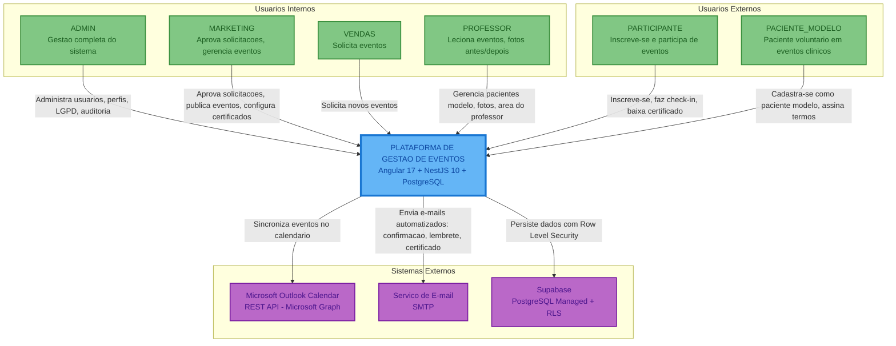

# Diagrama de Contexto (C4 - Nível 1) - Plataforma de Gestão de Eventos

**Versão**: 1.0 (Engenharia Reversa)
**Data**: 18/02/2026
**Nível C4**: 1 - Context
**Pergunta respondida**: "Quem usa o sistema e com o que ele se integra?"

---

## Visão Geral

A Plataforma de Gestão de Eventos é um sistema corporativo que permite a gestão completa do ciclo de vida de eventos educacionais/clínicos: desde a solicitação por equipes de Vendas, aprovação pelo Marketing, publicação, inscrições públicas, check-in com QR Code, gestão de pacientes modelo, até a emissão de certificados. O sistema integra-se com o Microsoft Outlook Calendar para sincronização de agenda e com serviço de e-mail para comunicação automatizada.

---

## Diagrama de Contexto

---

## Personas (Usuarios)

| Persona | Perfil | Papel Principal | Acesso |
|---------|--------|-----------------|--------|
| Administrador | ADMIN | Gestao completa: usuarios, perfis, LGPD, auditoria, configuracoes | Web (todas as telas) |
| Marketing | MARKETING | Aprova solicitacoes, publica eventos, configura certificados e templates de e-mail | Web (eventos, solicitacoes, config) |
| Vendas | VENDAS | Solicita novos eventos com justificativa e publico-alvo | Web (solicitacoes, dashboard) |
| Professor | PROFESSOR | Leciona eventos, gerencia pacientes modelo, registra fotos antes/depois | Web (area professor, documentos) |
| Participante | PARTICIPANTE | Inscreve-se em eventos publicos, faz check-in via QR Code, baixa certificados | Web (inscricao publica, area participante) |
| Paciente Modelo | PACIENTE_MODELO | Voluntario em eventos clinicos, assina termos de consentimento | Web (dados pessoais, privacidade) |

## Sistemas Externos

| Sistema | Protocolo | Finalidade | Criticidade |
|---------|-----------|------------|-------------|
| Microsoft Outlook Calendar | REST API (Microsoft Graph) | Sincronizacao bidirecional de eventos com calendario corporativo | Media |
| Servico de E-mail | SMTP | Envio automatizado: confirmacao de inscricao, lembretes, certificados, recuperacao de senha | Alta |
| Supabase | PostgreSQL Protocol (TCP/5432) | Banco de dados managed com Row Level Security e backups automaticos | Critica |

---

*Documento gerado por engenharia reversa - C4 Model Level 1*
