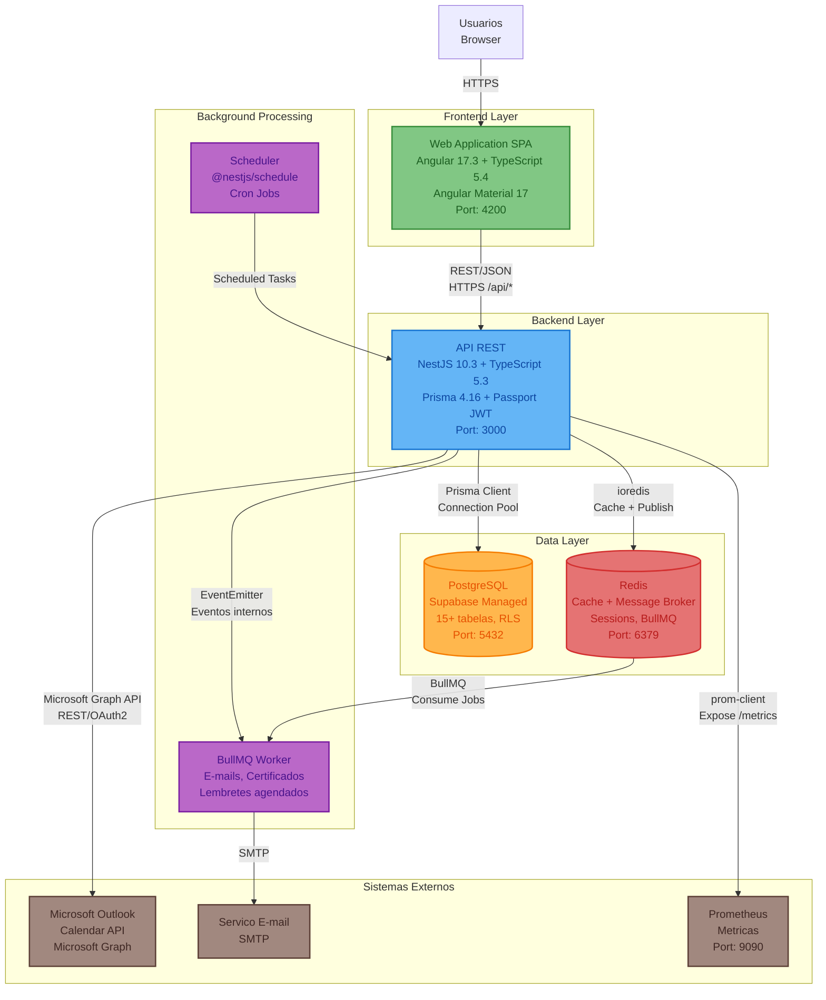

# Diagrama de Containers (C4 - Nível 2) - Plataforma de Gestão de Eventos

**Versão**: 1.0 (Engenharia Reversa)
**Data**: 18/02/2026
**Nível C4**: 2 - Containers
**Pergunta respondida**: "Quais aplicações e data stores compõem o sistema?"

---

## Visão Geral

O sistema é composto por 5 containers principais: uma aplicação web SPA (Angular 17), uma API REST (NestJS 10), um banco de dados relacional (PostgreSQL via Supabase), um broker de mensagens/cache (Redis) e um worker de background (BullMQ). A comunicação frontend-backend é via REST/JSON sobre HTTPS.

---

## Diagrama de Containers

---

## Containers Detalhados

### Web Application (Frontend)

| Atributo | Valor |
|----------|-------|
| **Tecnologia** | Angular 17.3 + TypeScript 5.4 |
| **UI Library** | Angular Material 17 |
| **State** | RxJS 7 + Angular Signals |
| **Porta** | 4200 (dev) |
| **Componentes** | 43 paginas + layout + core services |
| **Rotas** | 45+ (lazy loaded via `loadComponent()`) |
| **Autenticacao** | JWT token em localStorage + AuthGuard |
| **Mock API** | MockInterceptor para desenvolvimento (751 linhas) |

### API REST (Backend)

| Atributo | Valor |
|----------|-------|
| **Tecnologia** | NestJS 10.3 + TypeScript 5.3 |
| **ORM** | Prisma 4.16 |
| **Porta** | 3000 (prefixo `/api`) |
| **Autenticacao** | JWT (15min access + 7d refresh) + 2FA TOTP |
| **Seguranca** | Global Guards: JwtAuthGuard + RolesGuard + ThrottlerGuard |
| **Validacao** | Global ValidationPipe (whitelist + forbidNonWhitelisted) |
| **CORS** | Origin: `http://localhost:4200` (configuravel) |
| **Modulos Implementados** | AuthModule, UsuariosModule |
| **Modulos Pendentes** | EventosModule, InscricoesModule, CertificadosModule, PacientesModule, ComunicacaoModule |

### PostgreSQL (Database)

| Atributo | Valor |
|----------|-------|
| **Tecnologia** | PostgreSQL (Supabase) |
| **ORM** | Prisma 4.16 |
| **Porta** | 5432 |
| **Tabelas** | 15 (usuarios, solicitacoes, eventos, inscricoes, certificados, pacientes_modelo, templates_email, etc.) |
| **Enums** | 8 (PerfilUsuario, StatusSolicitacao, StatusEvento, StatusInscricao, etc.) |
| **Indices** | 30+ (performance queries) |
| **Seguranca** | Row Level Security (Supabase), dados sensiveis criptografados |

### Redis (Cache + Broker)

| Atributo | Valor |
|----------|-------|
| **Tecnologia** | Redis (via ioredis 5.3) |
| **Porta** | 6379 |
| **Uso como Cache** | Sessions, rate limiting |
| **Uso como Broker** | BullMQ jobs (e-mails, certificados, lembretes) |
| **Configuracao** | Host/Port/Password via env vars |

### BullMQ Worker (Background)

| Atributo | Valor |
|----------|-------|
| **Tecnologia** | BullMQ 5.1 + @nestjs/bullmq 10.1 |
| **Funcoes** | Envio de e-mails, geracao de certificados, lembretes agendados |
| **Retry** | Automatico com exponential backoff |
| **Scheduler** | @nestjs/schedule para cron jobs |

---

## Comunicacao entre Containers

| De | Para | Protocolo | Detalhes |
|----|------|-----------|----------|
| Browser | Frontend | HTTPS | SPA Angular servida via Angular CLI |
| Frontend | Backend API | REST/JSON HTTPS | Prefixo `/api`, MockInterceptor em dev |
| Backend API | PostgreSQL | Prisma Client (TCP) | Connection pooling, transactions |
| Backend API | Redis | ioredis (TCP) | Cache, publish BullMQ jobs |
| Redis | BullMQ Worker | BullMQ Protocol | Consume jobs assincrono |
| Backend API | Outlook | Microsoft Graph REST API | OAuth2, sincronizacao calendario |
| BullMQ Worker | Email SMTP | SMTP | Envio de e-mails transacionais |
| Backend API | Prometheus | HTTP /metrics | Exposicao de metricas prom-client |

---

*Documento gerado por engenharia reversa - C4 Model Level 2*
