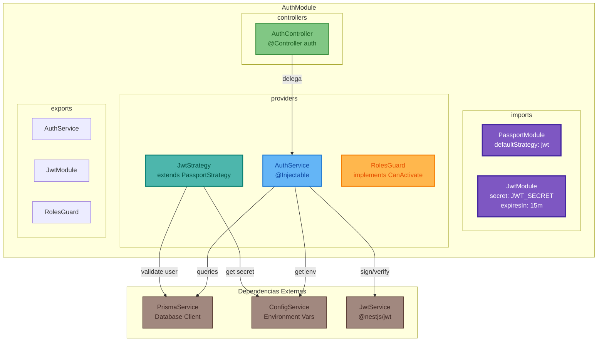
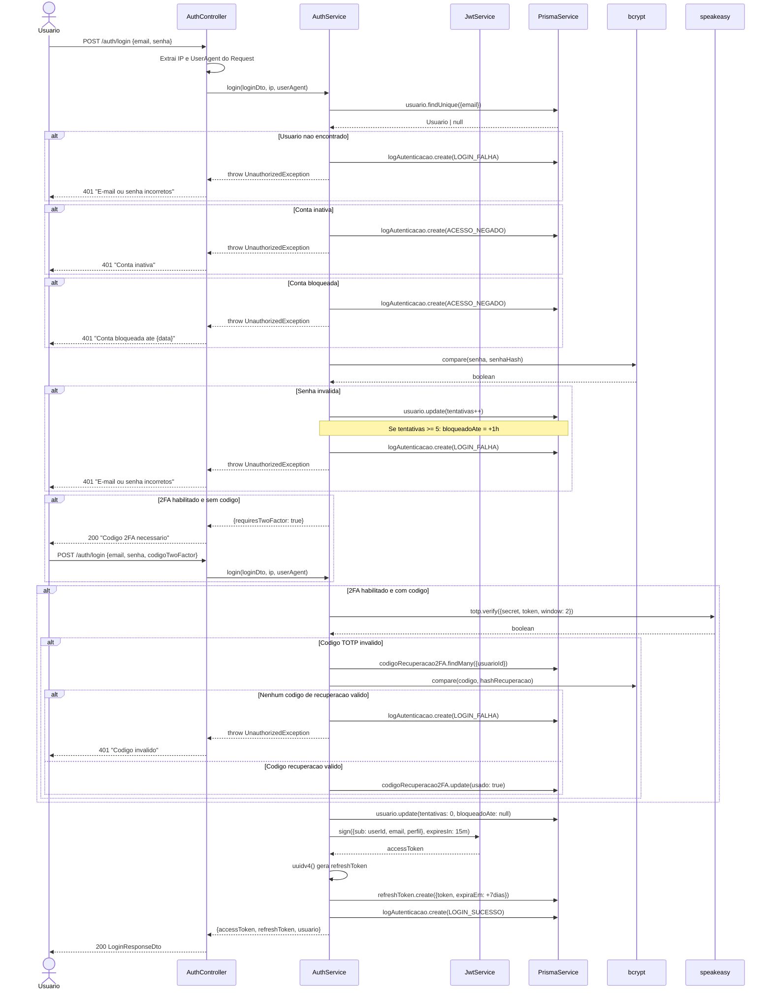
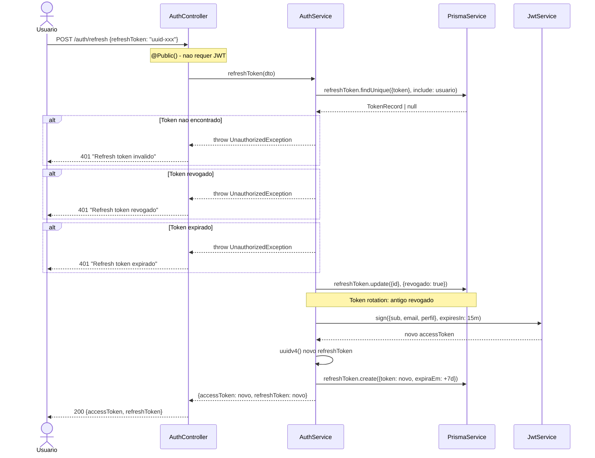

# Diagrama de Código (C4 - Nível 4) - Auth Module

**Versão**: 1.0 (Engenharia Reversa)
**Data**: 18/02/2026
**Nível C4**: 4 - Code
**Container**: API Backend (NestJS 10)
**Componente**: Auth Module (EP-08 - Controle de Acesso e Segurança)
**Pergunta respondida**: "Como o módulo de autenticação é implementado em nível de código?"

---

## Visão Geral

O C4 Level 4 detalha a estrutura interna de código do **Auth Module**, o componente mais crítico do sistema. Este módulo implementa: login com 2FA, geração/renovação de JWT, recuperação de senha, habilitação/desabilitação de 2FA, RBAC e logging de auditoria. Contém 14 arquivos organizados em 5 diretórios: controllers, services, strategies, guards, decorators e DTOs.

---

## Diagrama de Código - Visão Geral do Module



---

## Diagrama de Classes - Auth Module Completo

```mermaid
classDiagram
    class AuthModule {
        <<NestJS Module>>
        +imports: PassportModule, JwtModule
        +controllers: AuthController
        +providers: AuthService, JwtStrategy, RolesGuard
        +exports: AuthService, JwtModule, RolesGuard
    }

    class AuthController {
        <<@Controller auth>>
        -authService: AuthService
        +login(loginDto, req) LoginResponseDto | TwoFactorRequiredResponseDto
        +refreshToken(dto) RefreshTokenResponseDto
        +recuperarSenha(dto, req) RecuperarSenhaResponseDto
        +resetarSenha(dto) ResetarSenhaResponseDto
        +getTwoFactorStatus(user) TwoFactorStatusDto
        +habilitarTwoFactor(user) HabilitarTwoFactorResponseDto
        +validarTwoFactor(user, dto) ValidarTwoFactorResponseDto
        +desabilitarTwoFactor(user, dto) Message
        +getProfile(user) CurrentUserData
        +logout(dto) Message
    }

    class AuthService {
        <<@Injectable>>
        -prisma: PrismaService
        -jwtService: JwtService
        -configService: ConfigService
        +login(dto, ip, userAgent) LoginResponseDto | TwoFactorRequiredResponseDto
        +refreshToken(dto) TokenPair
        +recuperarSenha(dto, ip) Message
        +resetarSenha(dto) Message
        +habilitarTwoFactor(userId) HabilitarTwoFactorResponseDto
        +validarTwoFactor(userId, dto) ValidarTwoFactorResponseDto
        +desabilitarTwoFactor(userId, codigo) Message
        +getTwoFactorStatus(userId) TwoFactorStatusDto
        -generateTokens(userId, email, perfil) TokenPair
        -validarCodigoRecuperacao(userId, codigo) boolean
        -logAuthEvent(data) void
    }

    class JwtStrategy {
        <<extends PassportStrategy>>
        -configService: ConfigService
        -prisma: PrismaService
        +constructor() configures ExtractJwt.fromAuthHeaderAsBearerToken
        +validate(payload: JwtPayload) CurrentUserData
    }

    class JwtAuthGuard {
        <<extends AuthGuard jwt>>
        -reflector: Reflector
        +canActivate(context) boolean
    }

    class RolesGuard {
        <<implements CanActivate>>
        -reflector: Reflector
        +canActivate(context) boolean
    }

    class JwtPayload {
        <<interface>>
        +sub: string
        +email: string
        +perfil: string
    }

    class CurrentUserData {
        <<interface>>
        +id: string
        +email: string
        +nome: string
        +perfil: string
    }

    class LoginDto {
        <<class-validator>>
        +email: string @IsEmail @IsNotEmpty
        +senha: string @IsString @MinLength 8
        +codigoTwoFactor?: string @IsOptional
    }

    class LoginResponseDto {
        +accessToken: string
        +refreshToken: string
        +usuario: UsuarioResumo
    }

    class TwoFactorRequiredResponseDto {
        +requiresTwoFactor: true
        +message: string
    }

    class RefreshTokenDto {
        <<class-validator>>
        +refreshToken: string @IsString @IsNotEmpty
    }

    class RecuperarSenhaDto {
        <<class-validator>>
        +email: string @IsEmail @IsNotEmpty
    }

    class ResetarSenhaDto {
        <<class-validator>>
        +token: string @IsString @IsNotEmpty
        +novaSenha: string @MinLength 8 @Matches regex
    }

    class HabilitarTwoFactorResponseDto {
        +secret: string
        +qrCodeUrl: string
        +codigosRecuperacao: string[]
        +message: string
    }

    class ValidarTwoFactorDto {
        <<class-validator>>
        +codigo: string @Length 6,6
    }

    class DesabilitarTwoFactorDto {
        <<class-validator>>
        +codigo: string @Length 6,6
    }

    class TwoFactorStatusDto {
        +habilitado: boolean
        +habilitadoEm?: Date
    }

    class PublicDecorator {
        <<Custom Decorator>>
        +IS_PUBLIC_KEY: isPublic
        +Public() SetMetadata
    }

    class CurrentUserDecorator {
        <<Param Decorator>>
        +CurrentUser() createParamDecorator
    }

    class RequireRolesDecorator {
        <<Custom Decorator>>
        +RequireRoles(...roles) SetMetadata roles
    }

    AuthModule --> AuthController
    AuthModule --> AuthService
    AuthModule --> JwtStrategy
    AuthModule --> RolesGuard

    AuthController --> AuthService : delega
    AuthController ..> LoginDto : valida input
    AuthController ..> LoginResponseDto : retorna
    AuthController ..> TwoFactorRequiredResponseDto : retorna
    AuthController ..> RefreshTokenDto : valida input
    AuthController ..> RecuperarSenhaDto : valida input
    AuthController ..> ResetarSenhaDto : valida input
    AuthController ..> ValidarTwoFactorDto : valida input
    AuthController ..> DesabilitarTwoFactorDto : valida input
    AuthController ..> CurrentUserData : @CurrentUser

    AuthService ..> JwtPayload : cria payload
    AuthService ..> HabilitarTwoFactorResponseDto : retorna
    AuthService ..> TwoFactorStatusDto : retorna

    JwtStrategy ..> JwtPayload : valida
    JwtStrategy ..> CurrentUserData : retorna

    JwtAuthGuard ..> PublicDecorator : verifica isPublic
    RolesGuard ..> RequireRolesDecorator : verifica roles
```



---

## Diagrama de Sequência - Login com 2FA



---

## Diagrama de Sequência - Habilitar 2FA

```mermaid
sequenceDiagram
    actor User as Usuario Autenticado
    participant CTR as AuthController
    participant GRD as JwtAuthGuard
    participant SVC as AuthService
    participant DB as PrismaService
    participant SP as speakeasy
    participant QR as QRCode
    participant BC as bcrypt

    User->>CTR: POST /auth/2fa/habilitar (Bearer JWT)
    CTR->>GRD: canActivate(context)
    GRD->>GRD: Verifica @Public() = false
    GRD->>GRD: Valida JWT token
    GRD-->>CTR: user injetado no request

    CTR->>SVC: habilitarTwoFactor(user.id)

    SVC->>DB: usuario.findUnique({id})
    DB-->>SVC: Usuario

    alt 2FA ja habilitado
        SVC-->>CTR: throw BadRequestException
        CTR-->>User: 400 "2FA ja esta habilitado"
    end

    SVC->>SP: generateSecret({name: "Plataforma Eventos (email)", length: 32})
    SP-->>SVC: {base32, otpauth_url}

    SVC->>QR: toDataURL(otpauth_url)
    QR-->>SVC: qrCodeUrl (data:image/png;base64,...)

    loop 10 codigos de recuperacao
        SVC->>SVC: Math.random().toString(36).toUpperCase()
        SVC->>BC: hash(codigo, 10)
        BC-->>SVC: codigoHash
        SVC->>DB: codigoRecuperacao2FA.create({usuarioId, codigo: codigoHash})
    end

    SVC->>DB: usuario.update({twoFactorSecret: base32})

    SVC-->>CTR: {secret, qrCodeUrl, codigosRecuperacao, message}
    CTR-->>User: 200 HabilitarTwoFactorResponseDto

    Note over User: Escaneia QR Code no app autenticador

    User->>CTR: POST /auth/2fa/validar {codigo: "123456"} (Bearer JWT)
    CTR->>SVC: validarTwoFactor(user.id, dto)

    SVC->>DB: usuario.findUnique({id})
    SVC->>SP: totp.verify({secret, token: codigo, window: 2})
    SP-->>SVC: true

    SVC->>DB: usuario.update({twoFactorHabilitado: true, twoFactorHabilitadoEm: now()})

    SVC-->>CTR: {message: "2FA habilitado!", twoFactorHabilitado: true}
    CTR-->>User: 200 ValidarTwoFactorResponseDto
```

---

## Diagrama de Sequência - Refresh Token



---

## Estrutura de Arquivos - Auth Module

```
src/auth/
├── auth.module.ts              # NestJS Module definition
├── auth.controller.ts          # 10 endpoints REST (187 linhas)
├── auth.service.ts             # Logica de negocios (580 linhas)
│
├── strategies/
│   └── jwt.strategy.ts         # Passport JWT Strategy (63 linhas)
│                                  ExtractJwt.fromAuthHeaderAsBearerToken()
│                                  Valida usuario ativo/nao-bloqueado
│
├── guards/
│   ├── jwt-auth.guard.ts       # Guard global JWT (29 linhas)
│   │                              Respeita @Public() decorator
│   └── roles.guard.ts          # Guard global RBAC (39 linhas)
│                                  Verifica @RequireRoles() decorator
│
├── decorators/
│   ├── public.decorator.ts     # @Public() - marca rota sem auth (15 linhas)
│   ├── current-user.decorator.ts   # @CurrentUser() - extrai user do request (26 linhas)
│   └── require-roles.decorator.ts  # @RequireRoles(ADMIN) - define perfis (23 linhas)
│
└── dto/
    ├── login.dto.ts            # LoginDto + LoginResponseDto + TwoFactorRequiredResponseDto
    ├── refresh-token.dto.ts    # RefreshTokenDto + RefreshTokenResponseDto
    ├── recuperar-senha.dto.ts  # RecuperarSenhaDto + RecuperarSenhaResponseDto
    ├── resetar-senha.dto.ts    # ResetarSenhaDto + ResetarSenhaResponseDto (regex password)
    └── two-factor.dto.ts       # 6 DTOs para habilitar/validar/desabilitar 2FA
```

**Total**: 14 arquivos | ~962 linhas de código TypeScript

---

## Endpoints REST - AuthController

| Método | Rota | Auth | Decorator | DTO Input | DTO Output | Descrição |
|--------|------|------|-----------|-----------|------------|-----------|
| POST | `/auth/login` | @Public | - | LoginDto | LoginResponseDto \| TwoFactorRequiredResponseDto | Login com 2FA opcional |
| POST | `/auth/refresh` | @Public | - | RefreshTokenDto | RefreshTokenResponseDto | Renovar tokens (rotation) |
| POST | `/auth/recuperar-senha` | @Public | - | RecuperarSenhaDto | RecuperarSenhaResponseDto | Solicitar recuperação |
| POST | `/auth/resetar-senha` | @Public | - | ResetarSenhaDto | ResetarSenhaResponseDto | Resetar com token |
| GET | `/auth/me` | JWT | @CurrentUser | - | CurrentUserData | Perfil do autenticado |
| POST | `/auth/logout` | JWT | - | RefreshTokenDto | Message | Revogar refresh token |
| GET | `/auth/2fa/status` | JWT | @CurrentUser | - | TwoFactorStatusDto | Status do 2FA |
| POST | `/auth/2fa/habilitar` | JWT | @CurrentUser | - | HabilitarTwoFactorResponseDto | Gerar QR Code + códigos |
| POST | `/auth/2fa/validar` | JWT | @CurrentUser | ValidarTwoFactorDto | ValidarTwoFactorResponseDto | Confirmar habilitação |
| DELETE | `/auth/2fa` | JWT | @CurrentUser | DesabilitarTwoFactorDto | Message | Desabilitar 2FA |

---

## Dependências Externas (Libraries)

| Biblioteca | Versão | Uso no Auth Module |
|-----------|--------|-------------------|
| `@nestjs/jwt` | 10.2 | Geração e validação de JWT tokens |
| `@nestjs/passport` | 10.0 | Framework de strategies de autenticação |
| `passport-jwt` | 4.0 | Strategy para extrair JWT do Bearer header |
| `bcrypt` | 5.1 | Hash de senhas (rounds: 12) e códigos 2FA (rounds: 10) |
| `speakeasy` | 2.0 | Geração de secrets TOTP e validação de códigos 6 dígitos |
| `qrcode` | 1.5 | Geração de QR Code como Data URL (base64 PNG) |
| `uuid` | v4 | Geração de refresh tokens únicos |
| `date-fns` | 3.0 | `addDays(7)` para expiração de refresh, `addHours(1)` para bloqueio |
| `class-validator` | 0.14 | Decorators de validação: @IsEmail, @MinLength, @Matches, @Length |

---

## Regras de Negócio Implementadas

| ID | Regra | Implementação |
|----|-------|--------------|
| RN-AUTH-01 | Senha mínimo 8 caracteres | `@MinLength(8)` no LoginDto |
| RN-AUTH-02 | Senha forte no reset | `@Matches(/^(?=.*[a-z])(?=.*[A-Z])(?=.*\d])(?=.*[@$!%*?&])/)` |
| RN-AUTH-03 | Bloqueio após 5 tentativas | `if (tentativas >= 5) bloqueadoAte = addHours(1)` |
| RN-AUTH-04 | Token sempre retorna sucesso na recuperação | Não revela se email existe |
| RN-AUTH-05 | Token recuperação expira em 1 hora | `expiraEm = addHours(1)` |
| RN-AUTH-06 | Refresh token expira em 7 dias | `expiraEm = addDays(7)` |
| RN-AUTH-07 | Refresh token rotation | Antigo revogado, novo criado |
| RN-AUTH-08 | Reset revoga todos os refresh tokens | `refreshToken.updateMany({revogado: true})` |
| RN-AUTH-09 | 2FA com tolerância de 2 janelas | `speakeasy.totp.verify({window: 2})` |
| RN-AUTH-10 | 10 códigos de recuperação 2FA | `Math.random().toString(36)` hashados com bcrypt |
| RN-AUTH-11 | Validação de usuario ativo no JWT | JwtStrategy.validate() verifica ativo e bloqueado |
| RN-AUTH-12 | Logging de todos eventos de auth | `logAuthEvent()` com IP, UserAgent, tipo, sucesso |

---

*Documento gerado por engenharia reversa - C4 Model Level 4 (Code)*
*Componente: Auth Module | 14 arquivos | ~962 linhas TypeScript*
