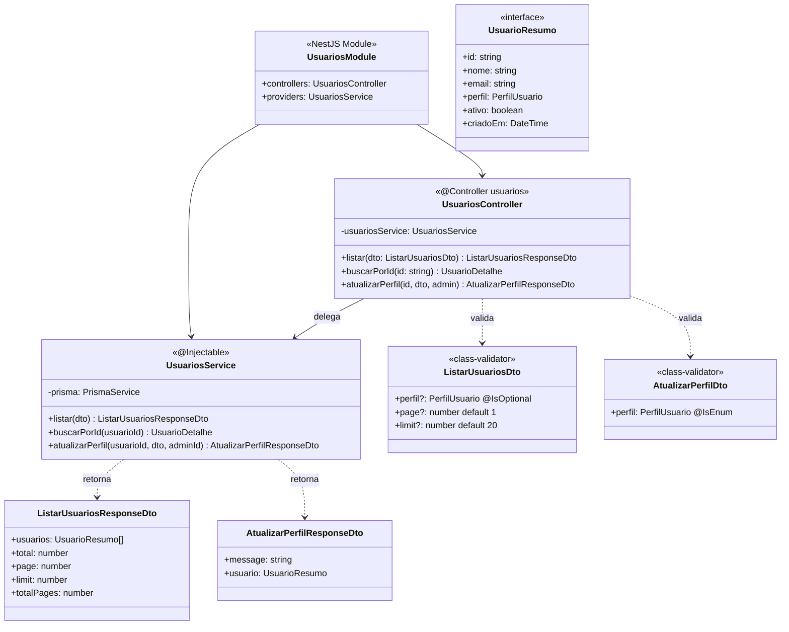

# Diagrama de Código (C4 - Nível 4) - Usuarios Module

**Versão**: 1.0 (Engenharia Reversa)
**Data**: 18/02/2026
**Nível C4**: 4 - Code
**Épico**: EP-08 - Controle de Acesso e Segurança (RBAC)
**Status**: Implementado

---

## Diagrama de Classes



---

## Endpoints REST

| Método | Rota | Auth | RBAC | DTO Input | DTO Output | Descrição |
|--------|------|------|------|-----------|------------|-----------|
| GET | `/usuarios` | JWT | ADMIN | ListarUsuariosDto (query) | ListarUsuariosResponseDto | Listar com paginação e filtro por perfil |
| GET | `/usuarios/:id` | JWT | ADMIN | - | UsuarioDetalhe | Buscar por ID |
| PUT | `/usuarios/:id/perfil` | JWT | ADMIN | AtualizarPerfilDto | AtualizarPerfilResponseDto | Alterar perfil do usuário |

## Regras de Negócio

| ID | Regra | Implementação |
|----|-------|--------------|
| RN-USR-01 | Apenas ADMIN acessa endpoints | `@RequireRoles(PerfilUsuario.ADMIN)` |
| RN-USR-02 | Admin não pode remover seu próprio perfil ADMIN | `if (usuarioId === adminId && dto.perfil !== ADMIN) throw Forbidden` |
| RN-USR-03 | Paginação com default 20 por página | `skip = (page-1) * limit` |
| RN-USR-04 | Listagem ordenada por data de criação desc | `orderBy: { criadoEm: 'desc' }` |
| RN-USR-05 | Senha nunca exposta nas respostas | `select` exclui `senhaHash` e `twoFactorSecret` |

## Estrutura de Arquivos

```
src/usuarios/
├── usuarios.module.ts          # Module definition
├── usuarios.controller.ts      # 3 endpoints (67 linhas)
├── usuarios.service.ts         # Lógica de negócios (123 linhas)
└── dto/
    ├── listar-usuarios.dto.ts  # ListarUsuariosDto + ResponseDto
    └── atualizar-perfil.dto.ts # AtualizarPerfilDto + ResponseDto
```

**Total**: ~5 arquivos | ~190 linhas TypeScript

---

*C4 Level 4 - Usuarios Module (Implementado)*
