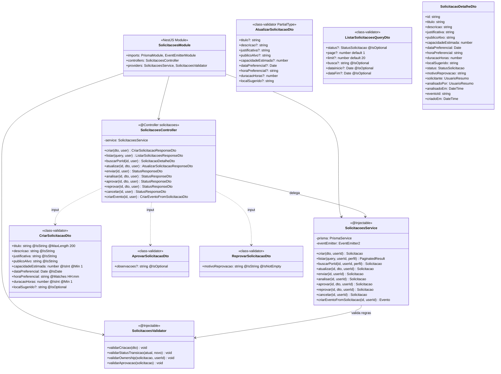
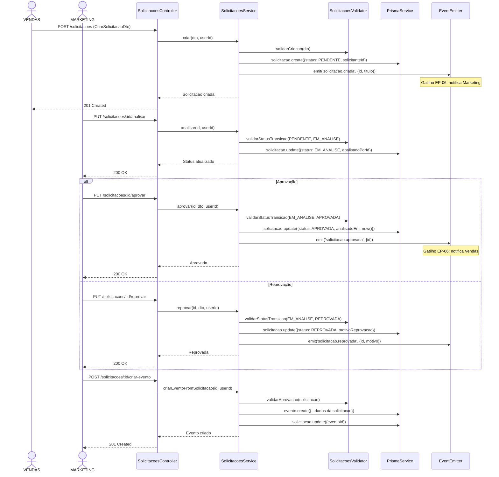
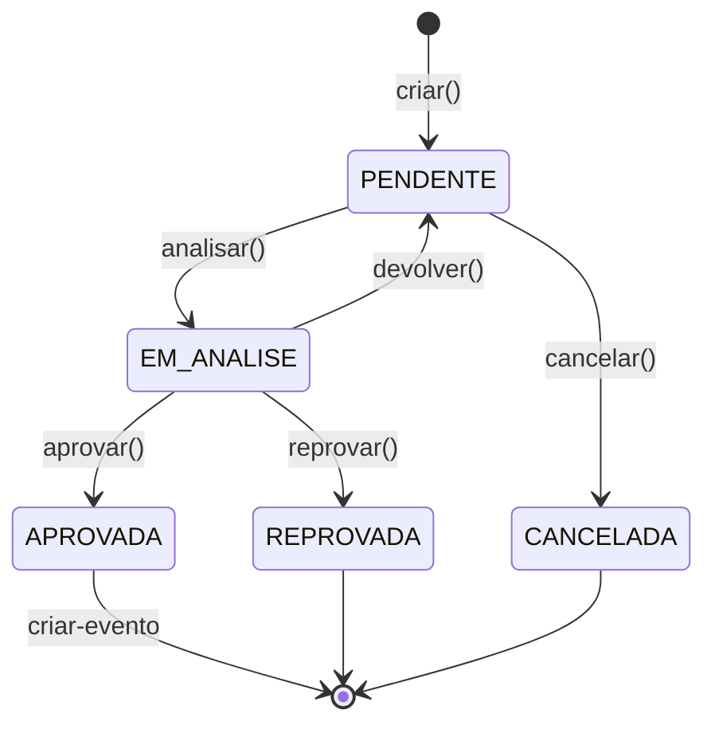

# Diagrama de Código (C4 - Nível 4) - Solicitações Module

**Versão**: 1.0 (Engenharia Reversa)
**Data**: 18/02/2026
**Nível C4**: 4 - Code
**Épico**: EP-01 - Gestão de Solicitações e Aprovação de Eventos
**Status**: Pendente (Schema Prisma + Frontend prontos)

---

## Diagrama de Classes



---

## Diagrama de Sequência - Workflow de Aprovação



---

## Máquina de Estados - StatusSolicitacao



## Endpoints REST

| Método | Rota | RBAC | Descrição |
|--------|------|------|-----------|
| POST | `/solicitacoes` | VENDAS, ADMIN | Criar solicitação |
| GET | `/solicitacoes` | VENDAS, MARKETING, ADMIN | Listar (filtro por perfil) |
| GET | `/solicitacoes/:id` | VENDAS, MARKETING, ADMIN | Detalhe |
| PUT | `/solicitacoes/:id` | VENDAS (owner) | Atualizar rascunho |
| PUT | `/solicitacoes/:id/enviar` | VENDAS (owner) | Enviar para análise |
| PUT | `/solicitacoes/:id/analisar` | MARKETING, ADMIN | Iniciar análise |
| PUT | `/solicitacoes/:id/aprovar` | MARKETING, ADMIN | Aprovar |
| PUT | `/solicitacoes/:id/reprovar` | MARKETING, ADMIN | Reprovar com motivo |
| PUT | `/solicitacoes/:id/cancelar` | VENDAS (owner), ADMIN | Cancelar |
| POST | `/solicitacoes/:id/criar-evento` | MARKETING, ADMIN | Criar evento vinculado |

## Estrutura de Arquivos Esperada

```
src/solicitacoes/
├── solicitacoes.module.ts
├── solicitacoes.controller.ts      # 10 endpoints
├── solicitacoes.service.ts         # Lógica + eventos
├── solicitacoes.validator.ts       # Regras de transição de status
└── dto/
    ├── criar-solicitacao.dto.ts
    ├── atualizar-solicitacao.dto.ts
    ├── aprovar-solicitacao.dto.ts
    ├── reprovar-solicitacao.dto.ts
    └── listar-solicitacoes.dto.ts
```

**Total estimado**: ~8 arquivos | ~600 linhas

---

*C4 Level 4 - Solicitações Module (EP-01)*
