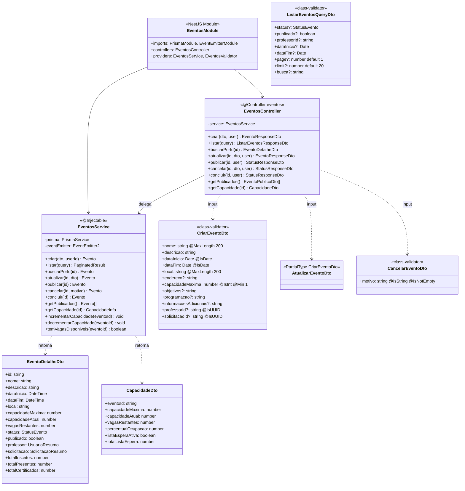
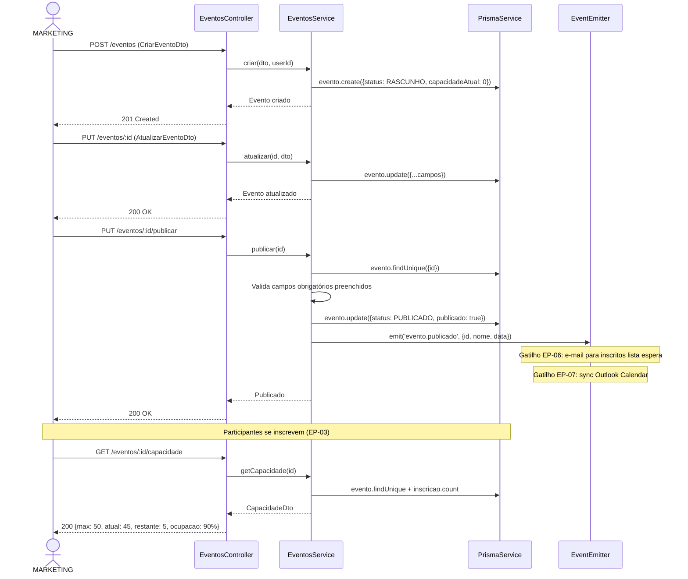
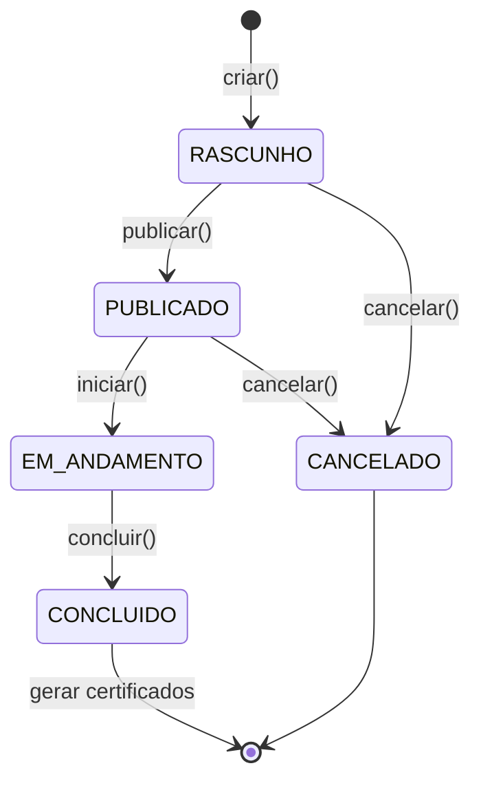

# Diagrama de Código (C4 - Nível 4) - Eventos Module

**Versão**: 1.0 (Engenharia Reversa)
**Data**: 18/02/2026
**Nível C4**: 4 - Code
**Épico**: EP-02 - Gestão e Publicação de Eventos
**Status**: Pendente (Schema Prisma + Frontend prontos)

---

## Diagrama de Classes



---

## Diagrama de Sequência - Publicação e Controle de Capacidade



## Máquina de Estados - StatusEvento



## Endpoints REST

| Método | Rota | RBAC | Descrição |
|--------|------|------|-----------|
| POST | `/eventos` | MARKETING, ADMIN | Criar evento |
| GET | `/eventos` | MARKETING, ADMIN | Listar com filtros |
| GET | `/eventos/:id` | MARKETING, ADMIN, PROFESSOR | Detalhe do evento |
| PUT | `/eventos/:id` | MARKETING, ADMIN | Atualizar evento |
| PUT | `/eventos/:id/publicar` | MARKETING, ADMIN | Publicar evento |
| PUT | `/eventos/:id/cancelar` | MARKETING, ADMIN | Cancelar com motivo |
| PUT | `/eventos/:id/concluir` | MARKETING, ADMIN | Finalizar evento |
| GET | `/eventos/publicados` | @Public | Eventos públicos (para inscrição) |
| GET | `/eventos/:id/capacidade` | MARKETING, ADMIN | Info de vagas |

## Estrutura de Arquivos Esperada

```
src/eventos/
├── eventos.module.ts
├── eventos.controller.ts          # 9 endpoints
├── eventos.service.ts             # Lógica + capacidade + eventos
├── eventos.validator.ts           # Transições de status
└── dto/
    ├── criar-evento.dto.ts
    ├── atualizar-evento.dto.ts
    ├── cancelar-evento.dto.ts
    └── listar-eventos.dto.ts
```

**Total estimado**: ~7 arquivos | ~500 linhas

---

*C4 Level 4 - Eventos Module (EP-02)*
