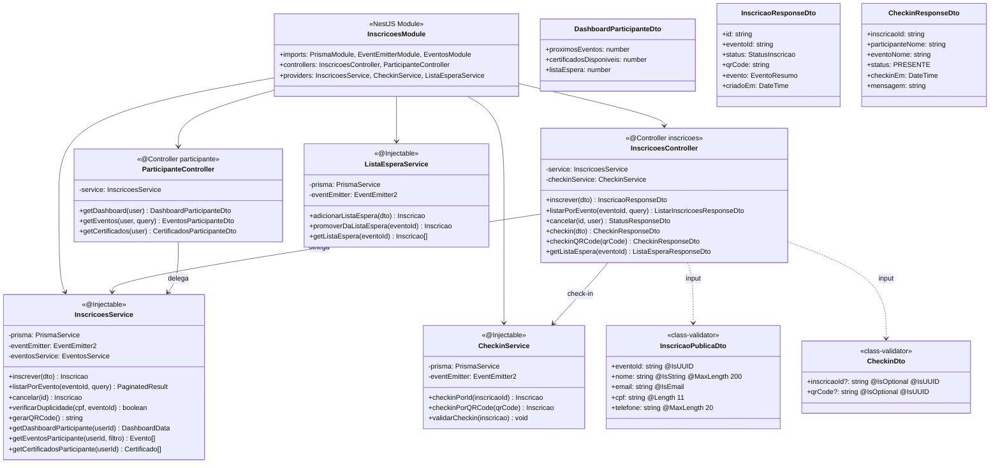
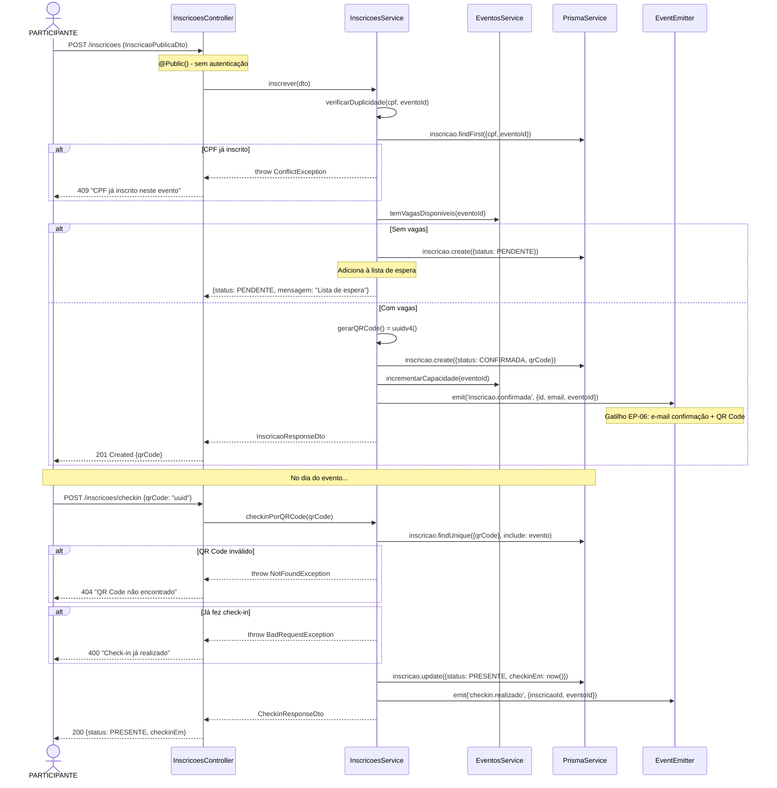
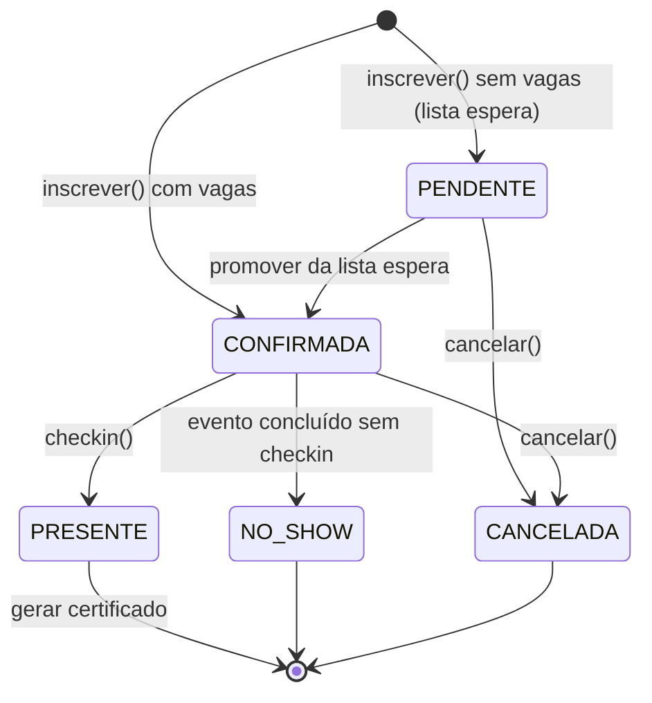

# Diagrama de Código (C4 - Nível 4) - Inscrições Module

**Versão**: 1.0 (Engenharia Reversa)
**Data**: 18/02/2026
**Nível C4**: 4 - Code
**Épico**: EP-03 - Sistema de Inscrições e Participantes
**Status**: Pendente (Schema Prisma + Frontend prontos)

---

## Diagrama de Classes



---

## Diagrama de Sequência - Inscrição Pública + Check-in



## Máquina de Estados - StatusInscricao



## Endpoints REST

| Método | Rota | Auth | RBAC | Descrição |
|--------|------|------|------|-----------|
| POST | `/inscricoes` | @Public | - | Inscrição pública |
| GET | `/eventos/:id/inscricoes` | JWT | MARKETING, ADMIN | Listar inscritos |
| PUT | `/inscricoes/:id/cancelar` | JWT | Owner, ADMIN | Cancelar inscrição |
| POST | `/inscricoes/checkin` | JWT | MARKETING, ADMIN | Check-in por ID ou QR |
| GET | `/eventos/:id/lista-espera` | JWT | MARKETING, ADMIN | Lista de espera |
| GET | `/participante/dashboard` | JWT | PARTICIPANTE | Dashboard do participante |
| GET | `/participante/eventos` | JWT | PARTICIPANTE | Eventos do participante |
| GET | `/participante/certificados` | JWT | PARTICIPANTE | Certificados disponíveis |

## Estrutura de Arquivos Esperada

```
src/inscricoes/
├── inscricoes.module.ts
├── inscricoes.controller.ts        # 6 endpoints
├── participante.controller.ts      # 3 endpoints (área do participante)
├── inscricoes.service.ts           # Inscrição + lista espera
├── checkin.service.ts              # Check-in por QR Code
├── lista-espera.service.ts         # Gestão de lista de espera
└── dto/
    ├── inscricao-publica.dto.ts
    ├── checkin.dto.ts
    ├── listar-inscricoes.dto.ts
    └── dashboard-participante.dto.ts
```

**Total estimado**: ~10 arquivos | ~700 linhas

---

*C4 Level 4 - Inscrições Module (EP-03)*
