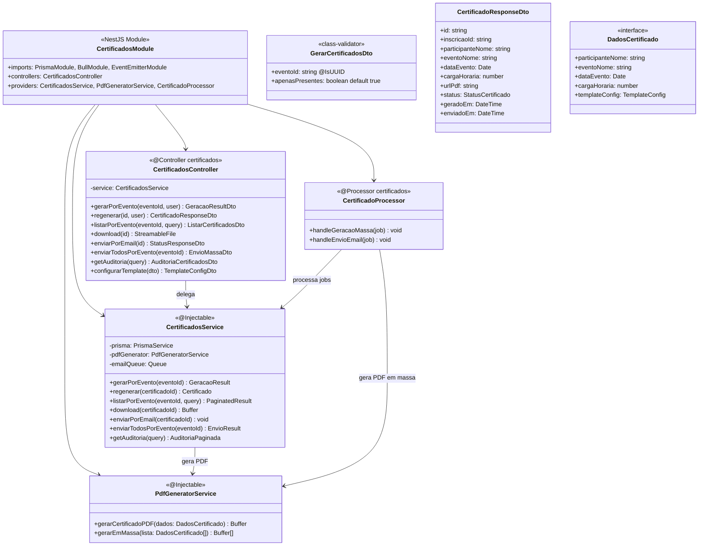
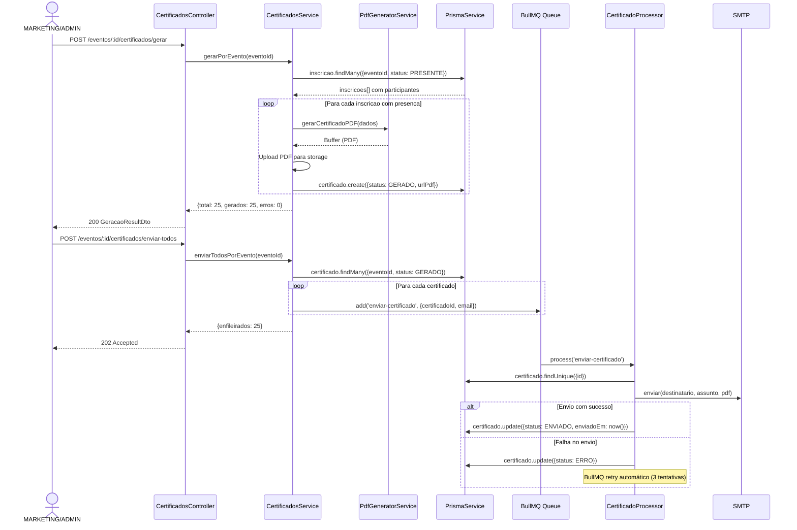
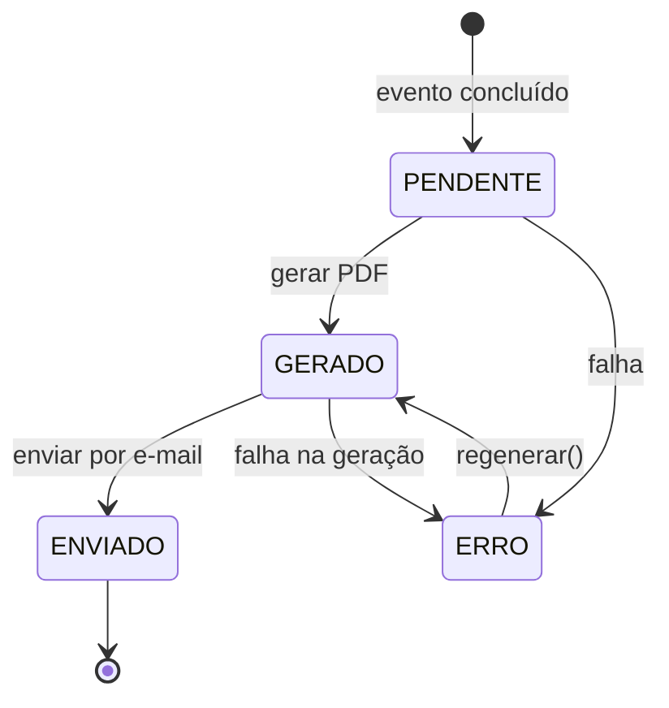

# Diagrama de Código (C4 - Nível 4) - Certificados Module

**Versão**: 1.0 (Engenharia Reversa)
**Data**: 18/02/2026
**Nível C4**: 4 - Code
**Épico**: EP-04 - Sistema de Certificação
**Status**: Pendente (Schema Prisma + Frontend prontos)

---

## Diagrama de Classes



---

## Diagrama de Sequência - Geração e Envio de Certificados



## Máquina de Estados - StatusCertificado



## Endpoints REST

| Método | Rota | RBAC | Descrição |
|--------|------|------|-----------|
| POST | `/eventos/:id/certificados/gerar` | MARKETING, ADMIN | Gerar certificados em massa |
| POST | `/certificados/:id/regenerar` | MARKETING, ADMIN | Regenerar individual |
| GET | `/eventos/:id/certificados` | MARKETING, ADMIN | Listar certificados do evento |
| GET | `/certificados/:id/download` | Owner, ADMIN | Download PDF |
| POST | `/certificados/:id/enviar` | MARKETING, ADMIN | Enviar individual por e-mail |
| POST | `/eventos/:id/certificados/enviar-todos` | MARKETING, ADMIN | Envio em massa |
| GET | `/certificados/auditoria` | ADMIN | Log de geração e envio |
| POST | `/certificados/template` | ADMIN | Configurar template |

## Estrutura de Arquivos Esperada

```
src/certificados/
├── certificados.module.ts
├── certificados.controller.ts       # 8 endpoints
├── certificados.service.ts          # Lógica de geração e envio
├── pdf-generator.service.ts         # Geração de PDF
├── certificado.processor.ts         # BullMQ worker (jobs assíncronos)
└── dto/
    ├── gerar-certificados.dto.ts
    ├── certificado-response.dto.ts
    └── listar-certificados.dto.ts
```

**Total estimado**: ~8 arquivos | ~550 linhas

---

*C4 Level 4 - Certificados Module (EP-04)*
