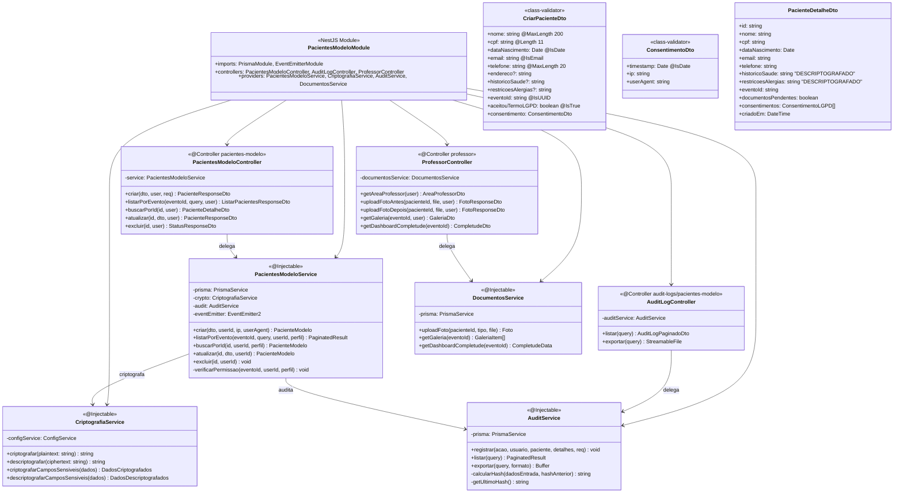
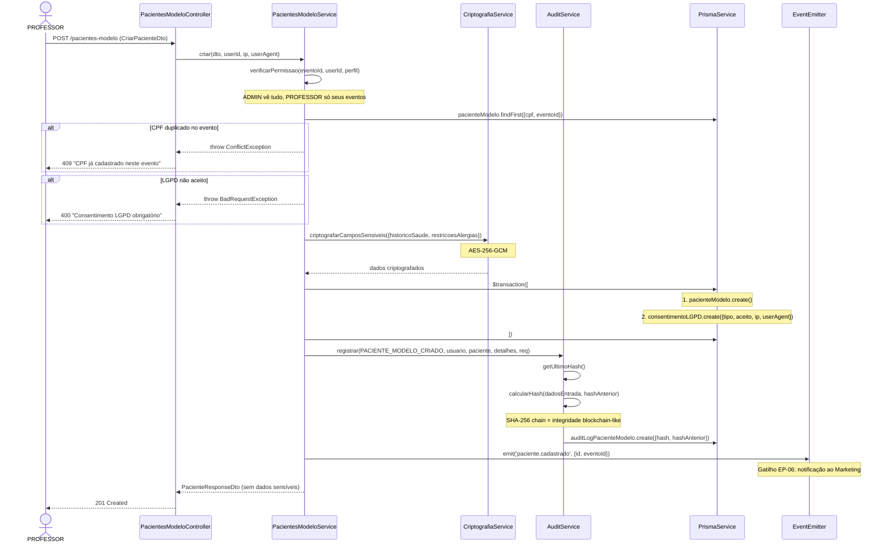
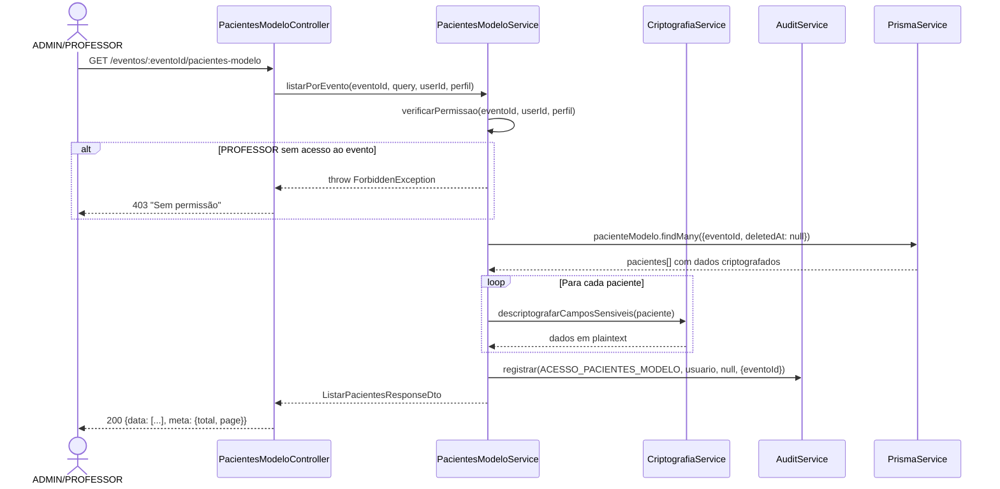

# Diagrama de Código (C4 - Nível 4) - Pacientes Modelo Module

**Versão**: 1.0 (Engenharia Reversa)
**Data**: 18/02/2026
**Nível C4**: 4 - Code
**Épico**: EP-05 - Gestão de Pacientes Modelo
**Status**: Pendente (Schema Prisma + Frontend prontos)

---

## Diagrama de Classes



---

## Diagrama de Sequência - Cadastro com Criptografia e Auditoria LGPD



---

## Diagrama de Sequência - Listagem com Descriptografia e RBAC



## Endpoints REST

| Método | Rota | RBAC | Descrição |
|--------|------|------|-----------|
| POST | `/pacientes-modelo` | PROFESSOR, ADMIN | Cadastrar com criptografia + LGPD |
| GET | `/eventos/:id/pacientes-modelo` | PROFESSOR (seus), ADMIN | Listar com descriptografia |
| GET | `/pacientes-modelo/:id` | PROFESSOR (seus), ADMIN | Detalhe individual |
| PUT | `/pacientes-modelo/:id` | PROFESSOR, ADMIN | Atualizar (re-criptografa) |
| DELETE | `/pacientes-modelo/:id` | ADMIN | Soft-delete (LGPD) |
| GET | `/professor/area` | PROFESSOR | Área do professor |
| POST | `/pacientes-modelo/:id/foto-antes` | PROFESSOR | Upload foto antes |
| POST | `/pacientes-modelo/:id/foto-depois` | PROFESSOR | Upload foto depois |
| GET | `/eventos/:id/galeria` | PROFESSOR, ADMIN | Galeria antes/depois |
| GET | `/eventos/:id/completude` | MARKETING, ADMIN | Dashboard completude docs |
| GET | `/audit-logs/pacientes-modelo` | ADMIN | Logs de auditoria |
| GET | `/audit-logs/pacientes-modelo/export` | ADMIN | Exportar auditoria CSV/JSON |

## Regras de Negócio LGPD

| ID | Regra | Implementação |
|----|-------|--------------|
| RN-LGPD-01 | Consentimento obrigatório | `aceitouTermoLGPD: true` obrigatório, 400 se false |
| RN-LGPD-02 | Dados sensíveis criptografados | AES-256-GCM para historicoSaude e restricoesAlergias |
| RN-LGPD-03 | Soft-delete apenas | `deletedAt` timestamp, nunca hard delete |
| RN-LGPD-04 | Auditoria com hash chain | SHA-256 encadeado (integridade tipo blockchain) |
| RN-LGPD-05 | Logs append-only | Retenção 5 anos, sem DELETE/UPDATE |
| RN-LGPD-06 | Registro de IP/UserAgent | Todos os consentimentos com rastreabilidade |
| RN-LGPD-07 | RBAC restritivo | Professor só vê pacientes dos seus eventos |

## Estrutura de Arquivos Esperada

```
src/pacientes-modelo/
├── pacientes-modelo.module.ts
├── pacientes-modelo.controller.ts   # 5 endpoints CRUD
├── professor.controller.ts          # 5 endpoints (area professor, fotos)
├── audit-log.controller.ts          # 2 endpoints (logs, export)
├── pacientes-modelo.service.ts      # Lógica + criptografia + auditoria
├── criptografia.service.ts          # AES-256-GCM encrypt/decrypt
├── audit.service.ts                 # Hash chain + logging
├── documentos.service.ts            # Fotos, galeria, completude
└── dto/
    ├── criar-paciente.dto.ts
    ├── atualizar-paciente.dto.ts
    ├── consentimento.dto.ts
    ├── listar-pacientes.dto.ts
    └── audit-log.dto.ts
```

**Total estimado**: ~13 arquivos | ~1200 linhas

---

*C4 Level 4 - Pacientes Modelo Module (EP-05) - O mais complexo do sistema*
