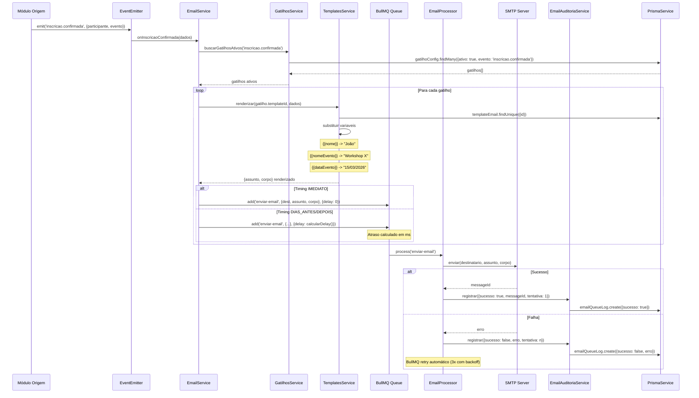

# Diagrama de Código (C4 - Nível 4) - Comunicação Module

**Versão**: 1.0 (Engenharia Reversa)
**Data**: 18/02/2026
**Nível C4**: 4 - Code
**Épico**: EP-06 - Sistema de Comunicação Automatizada
**Status**: Pendente (Schema Prisma + Frontend prontos)

---

## Diagrama de Classes

```mermaid
classDiagram
    class ComunicacaoModule {
        <<NestJS Module>>
        +imports: PrismaModule, BullModule, EventEmitterModule
        +controllers: TemplatesController, GatilhosController, AuditoriaEmailsController
        +providers: TemplatesService, GatilhosService, EmailService, EmailProcessor, EmailAuditoriaService
    }

    class TemplatesController {
        <<@Controller templates>>
        -service: TemplatesService
        +criar(dto) TemplateResponseDto
        +listar(query) ListarTemplatesDto
        +buscarPorId(id) TemplateDetalheDto
        +atualizar(id, dto) TemplateResponseDto
        +excluir(id) StatusResponseDto
        +preview(dto) PreviewResponseDto
        +testarEnvio(dto) StatusResponseDto
    }

    class GatilhosController {
        <<@Controller gatilhos>>
        -service: GatilhosService
        +criar(dto) GatilhoResponseDto
        +listar() GatilhoDto[]
        +atualizar(id, dto) GatilhoResponseDto
        +ativar(id) StatusResponseDto
        +desativar(id) StatusResponseDto
    }

    class AuditoriaEmailsController {
        <<@Controller auditoria-emails>>
        -auditoriaService: EmailAuditoriaService
        +listar(query) AuditoriaEmailsPaginadoDto
        +getEstatisticas(query) EstatisticasEmailDto
    }

    class TemplatesService {
        <<@Injectable>>
        -prisma: PrismaService
        +criar(dto) TemplateEmail
        +listar(query) PaginatedResult
        +buscarPorId(id) TemplateEmail
        +atualizar(id, dto) TemplateEmail
        +excluir(id) void
        +renderizar(templateId, contexto) EmailRenderizado
        +preview(templateId, dadosExemplo) PreviewResult
    }

    class GatilhosService {
        <<@Injectable>>
        -prisma: PrismaService
        +criar(dto) GatilhoConfig
        +listar() GatilhoConfig[]
        +atualizar(id, dto) GatilhoConfig
        +ativar(id) void
        +desativar(id) void
        +buscarGatilhosAtivos(tipoEvento) GatilhoConfig[]
        +calcularDataDisparo(gatilho, eventoData) Date
    }

    class EmailService {
        <<@Injectable>>
        -templatesService: TemplatesService
        -gatilhosService: GatilhosService
        -emailQueue: Queue
        +processarEvento(tipoEvento, dados) void
        +enfileirar(destinatario, assunto, corpo) void
        +enviarImediato(destinatario, assunto, corpo) void
    }

    class EmailProcessor {
        <<@Processor emails>>
        -emailAuditoria: EmailAuditoriaService
        +handleEnvioEmail(job) void
        +handleEnvioMassa(job) void
    }

    class EmailAuditoriaService {
        <<@Injectable>>
        -prisma: PrismaService
        +registrar(log: EmailLogData) void
        +listar(query) PaginatedResult
        +getEstatisticas(query) EstatisticasResult
    }

    class CriarTemplateDto {
        <<class-validator>>
        +nome: string @IsString @MaxLength 100
        +descricao?: string
        +assunto: string @MaxLength 255
        +corpo: string @IsString
        +variaveis: object
    }

    class CriarGatilhoDto {
        <<class-validator>>
        +nome: string @MaxLength 100
        +descricao: string
        +templateId: string @IsUUID
        +timingTipo: TipoTiming @IsEnum
        +timingValor?: number @IsOptional @IsInt
    }

    class PreviewDto {
        <<class-validator>>
        +templateId: string @IsUUID
        +dadosExemplo: object
    }

    ComunicacaoModule --> TemplatesController
    ComunicacaoModule --> GatilhosController
    ComunicacaoModule --> AuditoriaEmailsController
    ComunicacaoModule --> TemplatesService
    ComunicacaoModule --> GatilhosService
    ComunicacaoModule --> EmailService
    ComunicacaoModule --> EmailProcessor
    ComunicacaoModule --> EmailAuditoriaService

    TemplatesController --> TemplatesService : CRUD templates
    GatilhosController --> GatilhosService : CRUD gatilhos
    AuditoriaEmailsController --> EmailAuditoriaService : consulta logs
    EmailService --> TemplatesService : renderiza
    EmailService --> GatilhosService : busca gatilhos
    EmailProcessor --> EmailAuditoriaService : registra logs
```



---

## Diagrama de Sequência - Motor de Gatilhos Event-Driven



## Eventos Suportados pelo Motor de Gatilhos

| Evento | Origem | Variáveis Disponíveis |
|--------|--------|-----------------------|
| `inscricao.confirmada` | EP-03 | nome, email, nomeEvento, dataEvento, horaEvento, local, qrCode |
| `inscricao.cancelada` | EP-03 | nome, email, nomeEvento |
| `certificado.gerado` | EP-04 | nome, email, nomeEvento, linkCertificado, cargaHoraria |
| `solicitacao.aprovada` | EP-01 | nomeVendedor, tituloSolicitacao |
| `solicitacao.reprovada` | EP-01 | nomeVendedor, tituloSolicitacao, motivoReprovacao |
| `evento.publicado` | EP-02 | nomeEvento, dataEvento, local, linkInscricao |
| `evento.lembrete` | EP-02 (Cron) | nome, nomeEvento, dataEvento, horaEvento, local |
| `paciente.cadastrado` | EP-05 | nomePaciente, nomeEvento, nomeProfessor |

## Endpoints REST

| Método | Rota | RBAC | Descrição |
|--------|------|------|-----------|
| POST | `/templates` | MARKETING, ADMIN | Criar template |
| GET | `/templates` | MARKETING, ADMIN | Listar templates |
| GET | `/templates/:id` | MARKETING, ADMIN | Detalhe |
| PUT | `/templates/:id` | MARKETING, ADMIN | Atualizar |
| DELETE | `/templates/:id` | ADMIN | Excluir |
| POST | `/templates/preview` | MARKETING, ADMIN | Preview com dados exemplo |
| POST | `/templates/:id/testar` | MARKETING, ADMIN | Enviar e-mail de teste |
| POST | `/gatilhos` | MARKETING, ADMIN | Criar gatilho |
| GET | `/gatilhos` | MARKETING, ADMIN | Listar |
| PUT | `/gatilhos/:id` | MARKETING, ADMIN | Atualizar |
| PUT | `/gatilhos/:id/ativar` | MARKETING, ADMIN | Ativar |
| PUT | `/gatilhos/:id/desativar` | MARKETING, ADMIN | Desativar |
| GET | `/auditoria-emails` | ADMIN | Logs de envio |
| GET | `/auditoria-emails/estatisticas` | ADMIN | Taxa sucesso/falha |

## Estrutura de Arquivos Esperada

```
src/comunicacao/
├── comunicacao.module.ts
├── templates.controller.ts          # 7 endpoints
├── gatilhos.controller.ts           # 5 endpoints
├── auditoria-emails.controller.ts   # 2 endpoints
├── templates.service.ts             # CRUD + renderização
├── gatilhos.service.ts              # CRUD + busca ativos
├── email.service.ts                 # Motor event-driven + enfileiramento
├── email.processor.ts               # BullMQ worker (SMTP)
├── email-auditoria.service.ts       # Logging de envios
└── dto/
    ├── criar-template.dto.ts
    ├── criar-gatilho.dto.ts
    ├── preview.dto.ts
    └── auditoria-emails.dto.ts
```

**Total estimado**: ~13 arquivos | ~900 linhas

---

*C4 Level 4 - Comunicação Module (EP-06)*
