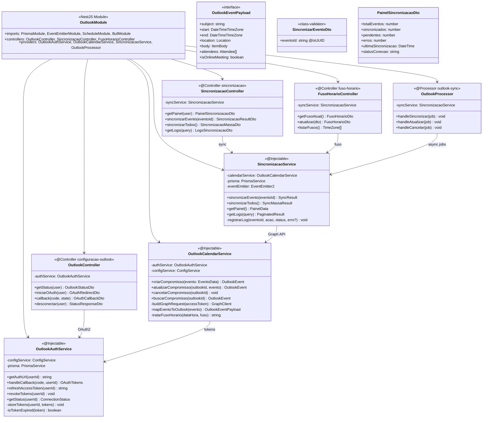
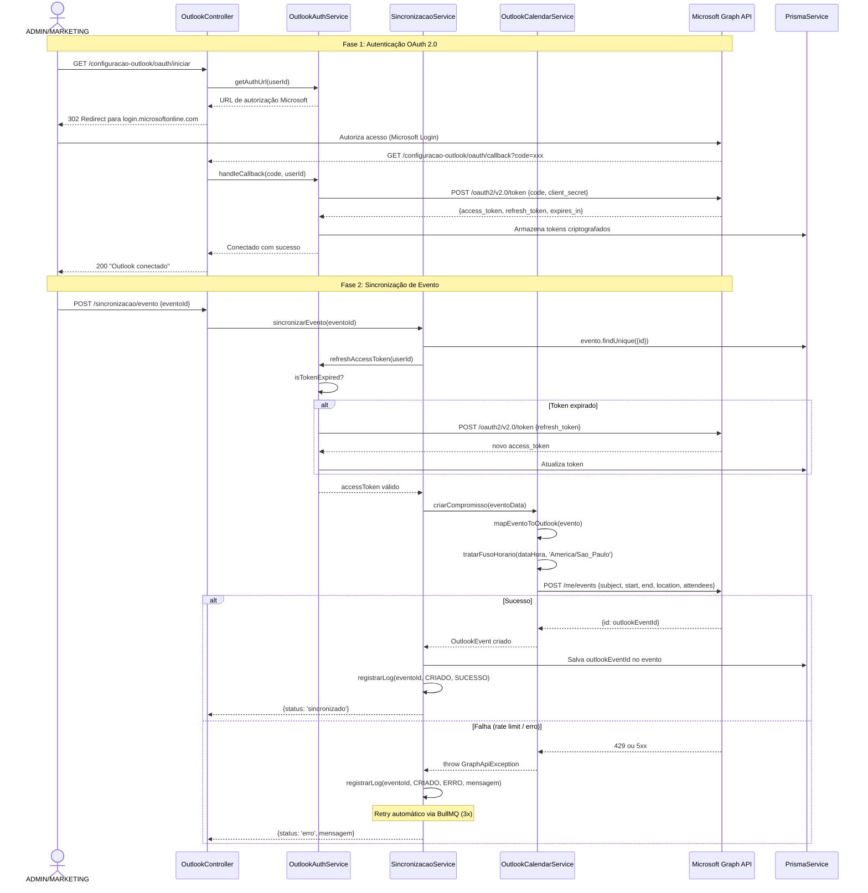

# Diagrama de Código (C4 - Nível 4) - Outlook Integration Module

**Versão**: 1.0 (Engenharia Reversa)
**Data**: 18/02/2026
**Nível C4**: 4 - Code
**Épico**: EP-07 - Integração com Microsoft Outlook Calendar
**Status**: Pendente (Frontend pronto)

---

## Diagrama de Classes



---

## Diagrama de Sequência - OAuth2 + Sincronização



## Endpoints REST

| Método | Rota | RBAC | Descrição |
|--------|------|------|-----------|
| GET | `/configuracao-outlook/status` | ADMIN, MARKETING | Status da conexão |
| GET | `/configuracao-outlook/oauth/iniciar` | ADMIN | Iniciar fluxo OAuth2 |
| GET | `/configuracao-outlook/oauth/callback` | @Public | Callback Microsoft |
| DELETE | `/configuracao-outlook/desconectar` | ADMIN | Revogar tokens |
| GET | `/sincronizacao/painel` | ADMIN, MARKETING | Painel de status |
| POST | `/sincronizacao/evento` | ADMIN, MARKETING | Sync evento individual |
| POST | `/sincronizacao/todos` | ADMIN | Sync em massa |
| GET | `/sincronizacao/logs` | ADMIN | Logs de sincronização |
| GET | `/fuso-horario` | ADMIN, MARKETING | Fuso atual |
| PUT | `/fuso-horario` | ADMIN | Alterar fuso |
| GET | `/fuso-horario/listar` | ADMIN, MARKETING | Lista de fusos |

## Estrutura de Arquivos Esperada

```
src/outlook/
├── outlook.module.ts
├── outlook.controller.ts            # 4 endpoints (OAuth)
├── sincronizacao.controller.ts      # 4 endpoints (sync)
├── fuso-horario.controller.ts       # 3 endpoints
├── outlook-auth.service.ts          # OAuth 2.0 token management
├── outlook-calendar.service.ts      # Microsoft Graph API calls
├── sincronizacao.service.ts         # Orquestração de sync
├── outlook.processor.ts             # BullMQ worker (async sync)
└── dto/
    ├── outlook-status.dto.ts
    ├── sincronizacao.dto.ts
    └── fuso-horario.dto.ts
```

**Total estimado**: ~12 arquivos | ~800 linhas

---

*C4 Level 4 - Outlook Integration Module (EP-07)*
