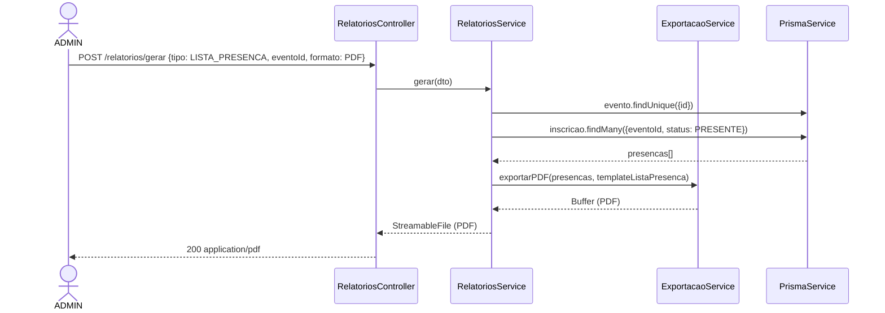
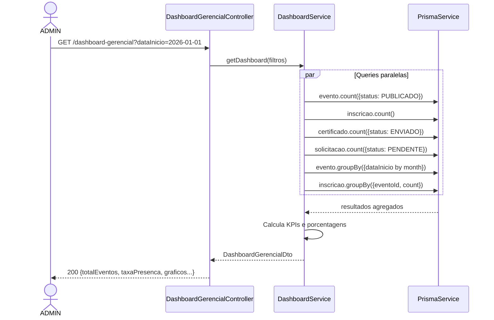

# Diagrama de Código (C4 - Nível 4) - Relatórios Module

**Versão**: 1.0 (Engenharia Reversa)
**Data**: 18/02/2026
**Nível C4**: 4 - Code
**Épico**: EP-09 - Relatórios e Exportações
**Status**: Pendente (Frontend pronto)

---

## Diagrama de Classes

```mermaid
classDiagram
    class RelatoriosModule {
        <<NestJS Module>>
        +imports: PrismaModule, BullModule, ScheduleModule, ComunicacaoModule
        +controllers: RelatoriosController, ExportacaoController, DashboardGerencialController
        +providers: RelatoriosService, ExportacaoService, DashboardService, RelatorioProcessor
    }

    class RelatoriosController {
        <<@Controller relatorios>>
        -service: RelatoriosService
        +gerar(dto) RelatorioResponseDto | StreamableFile
        +listarTipos() TipoRelatorioDto[]
        +getHistorico(query) HistoricoRelatoriosDto
        +agendar(dto) AgendamentoResponseDto
        +listarAgendamentos() AgendamentoDto[]
        +cancelarAgendamento(id) StatusResponseDto
    }

    class ExportacaoController {
        <<@Controller exportar>>
        -service: ExportacaoService
        +exportar(dto) StreamableFile | JobResponseDto
        +getStatusJob(jobId) JobStatusDto
        +downloadJob(jobId) StreamableFile
    }

    class DashboardGerencialController {
        <<@Controller dashboard-gerencial>>
        -service: DashboardService
        +getDashboard(query) DashboardGerencialDto
        +getKPIs(query) KPIsDto
        +getGraficos(tipo, query) GraficoDataDto
    }

    class RelatoriosService {
        <<@Injectable>>
        -prisma: PrismaService
        -exportacaoService: ExportacaoService
        +gerar(dto) RelatorioResult
        +gerarListaPresenca(eventoId) PresencaData[]
        +gerarInscritos(eventoId) InscritosData[]
        +gerarStatusDocumentos(eventoId) DocumentosData[]
        +gerarCertificadosEnviados(eventoId) CertificadosData[]
        +gerarSolicitacoes(filtros) SolicitacoesData[]
        +agendar(dto) Agendamento
        +listarAgendamentos() Agendamento[]
    }

    class ExportacaoService {
        <<@Injectable>>
        -relatorioQueue: Queue
        +exportarCSV(dados, colunas) Buffer
        +exportarPDF(dados, template) Buffer
        +exportarExcel(dados, colunas) Buffer
        +exportarAssincrono(dto) string
        +getStatusJob(jobId) JobStatus
        +getResultadoJob(jobId) Buffer
    }

    class DashboardService {
        <<@Injectable>>
        -prisma: PrismaService
        +getDashboard(filtros) DashboardData
        +getKPIs(filtros) KPIsData
        +getGraficoEventosPorMes(filtros) GraficoData
        +getGraficoInscricoesPorEvento(filtros) GraficoData
        +getGraficoTaxaPresenca(filtros) GraficoData
        +getGraficoSolicitacoesPorStatus(filtros) GraficoData
    }

    class RelatorioProcessor {
        <<@Processor relatorios>>
        -relatoriosService: RelatoriosService
        -exportacaoService: ExportacaoService
        -emailService: EmailService
        +handleGeracaoAssincrona(job) void
        +handleAgendado(job) void
    }

    class GerarRelatorioDto {
        <<class-validator>>
        +tipo: TipoRelatorio @IsEnum
        +eventoId?: string @IsOptional @IsUUID
        +dataInicio?: Date @IsOptional
        +dataFim?: Date @IsOptional
        +status?: string @IsOptional
        +formato: FormatoExportacao @IsEnum
    }

    class ExportarDto {
        <<class-validator>>
        +entidade: string @IsString
        +filtros?: object @IsOptional
        +colunas?: string[] @IsOptional
        +formato: FormatoExportacao @IsEnum
    }

    class DashboardGerencialDto {
        +totalEventos: number
        +eventosAtivos: number
        +totalInscricoes: number
        +taxaPresencaMedia: number
        +totalCertificados: number
        +solicitacoesPendentes: number
        +eventosPorMes: GraficoData
        +inscricoesPorEvento: GraficoData
        +topEventos: EventoResumo[]
    }

    class KPIsDto {
        +taxaConversaoInscricaoPresenca: number
        +tempoMedioAprovacaoSolicitacao: number
        +taxaPreenchimentoDocumentos: number
        +certificadosEnviadosVsGerados: number
        +mediaSatisfacao: number
    }

    class TipoRelatorio {
        <<enumeration>>
        LISTA_PRESENCA
        INSCRITOS_POR_EVENTO
        STATUS_DOCUMENTOS
        CERTIFICADOS_ENVIADOS
        SOLICITACOES
    }

    class FormatoExportacao {
        <<enumeration>>
        CSV
        PDF
        EXCEL
    }

    RelatoriosModule --> RelatoriosController
    RelatoriosModule --> ExportacaoController
    RelatoriosModule --> DashboardGerencialController
    RelatoriosModule --> RelatoriosService
    RelatoriosModule --> ExportacaoService
    RelatoriosModule --> DashboardService
    RelatoriosModule --> RelatorioProcessor

    RelatoriosController --> RelatoriosService : gera relatórios
    ExportacaoController --> ExportacaoService : exporta dados
    DashboardGerencialController --> DashboardService : dashboards
    RelatoriosService --> ExportacaoService : formata output
    RelatorioProcessor --> RelatoriosService : jobs assíncronos
```



---

## Diagrama de Sequência - Geração de Relatório + Dashboard Gerencial





## 5 Tipos de Relatório

| Tipo | Fonte | Campos | Formatos |
|------|-------|--------|----------|
| Lista de Presença | Inscricao (PRESENTE) | Nome, CPF, E-mail, Telefone, Horário Check-in | CSV, PDF |
| Inscritos por Evento | Inscricao (todos) | Nome, CPF, E-mail, Status, Data Inscrição | CSV, PDF, Excel |
| Status de Documentos | PacienteModelo | Nome, Evento, Anamnese, Termo, Fotos, Completude | CSV, PDF |
| Certificados Enviados | Certificado | Participante, Evento, Data, Carga Horária, Status, Data Envio | CSV, PDF |
| Solicitações | Solicitacao | Título, Solicitante, Status, Data, Motivo Reprovação | CSV, PDF, Excel |

## Endpoints REST

| Método | Rota | RBAC | Descrição |
|--------|------|------|-----------|
| POST | `/relatorios/gerar` | MARKETING, ADMIN | Gerar relatório |
| GET | `/relatorios/tipos` | MARKETING, ADMIN | Listar tipos disponíveis |
| GET | `/relatorios/historico` | ADMIN | Histórico de geração |
| POST | `/relatorios/agendar` | ADMIN | Agendar geração periódica |
| GET | `/relatorios/agendamentos` | ADMIN | Listar agendamentos |
| DELETE | `/relatorios/agendamentos/:id` | ADMIN | Cancelar agendamento |
| POST | `/exportar` | MARKETING, ADMIN | Exportação genérica |
| GET | `/exportar/job/:id` | MARKETING, ADMIN | Status do job |
| GET | `/exportar/job/:id/download` | MARKETING, ADMIN | Download resultado |
| GET | `/dashboard-gerencial` | ADMIN | Dashboard completo |
| GET | `/dashboard-gerencial/kpis` | ADMIN | KPIs calculados |
| GET | `/dashboard-gerencial/graficos/:tipo` | ADMIN | Dados para gráficos |

## Estrutura de Arquivos Esperada

```
src/relatorios/
├── relatorios.module.ts
├── relatorios.controller.ts           # 6 endpoints
├── exportacao.controller.ts           # 3 endpoints
├── dashboard-gerencial.controller.ts  # 3 endpoints
├── relatorios.service.ts              # 5 tipos de relatório
├── exportacao.service.ts              # CSV, PDF, Excel
├── dashboard.service.ts               # KPIs, gráficos
├── relatorio.processor.ts             # BullMQ (assíncrono + agendados)
└── dto/
    ├── gerar-relatorio.dto.ts
    ├── exportar.dto.ts
    ├── dashboard-gerencial.dto.ts
    └── agendamento.dto.ts
```

**Total estimado**: ~12 arquivos | ~900 linhas

---

*C4 Level 4 - Relatórios Module (EP-09)*
