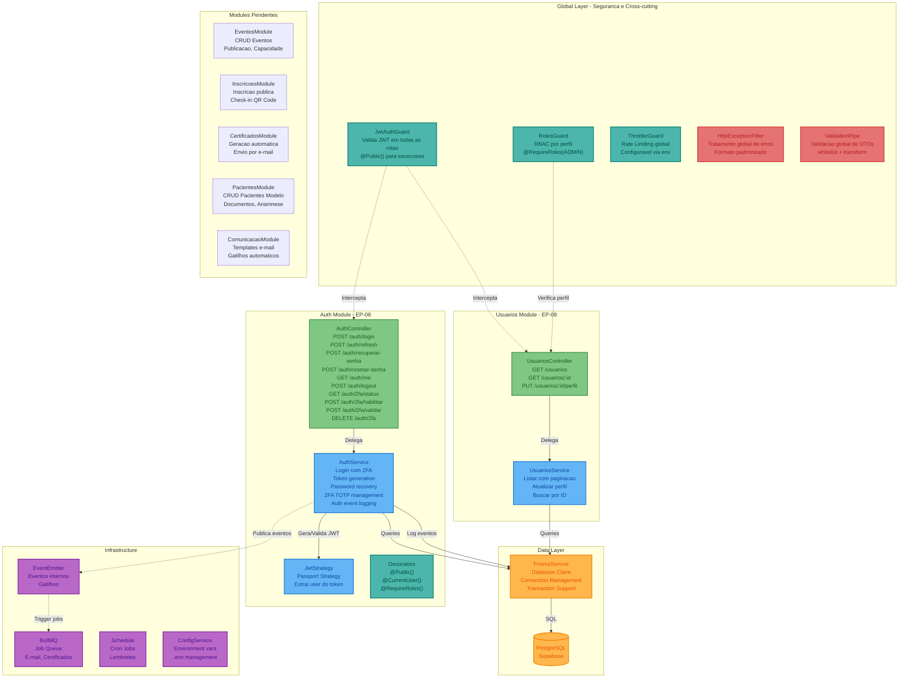

# Diagrama de Componentes (C4 - Nível 3) - Plataforma de Gestão de Eventos

**Versão**: 1.0 (Engenharia Reversa)
**Data**: 18/02/2026
**Nível C4**: 3 - Components
**Pergunta respondida**: "Como cada container é estruturado internamente?"

---

## 3A. Componentes do Backend (NestJS)

### Visão Geral

O backend segue a arquitetura modular do NestJS com separação em módulos de feature. Cada módulo contém Controllers, Services, Guards, Decorators e DTOs. A segurança é centralizada via Global Guards (JWT + RBAC + Throttler).

### Diagrama de Componentes - Backend

### Componentes Implementados

| Componente | Tipo | Responsabilidade |
|-----------|------|------------------|
| **AuthController** | Controller | 10 endpoints de autenticacao (login, refresh, 2FA, recuperacao) |
| **AuthService** | Service | Logica de login, tokens JWT, 2FA TOTP, logging de eventos |
| **JwtStrategy** | Strategy | Passport strategy para extrair usuario do token JWT |
| **JwtAuthGuard** | Guard | Protecao global - valida JWT em todas as rotas |
| **RolesGuard** | Guard | RBAC global - verifica perfil do usuario |
| **ThrottlerGuard** | Guard | Rate limiting global |
| **HttpExceptionFilter** | Filter | Tratamento padronizado de erros HTTP |
| **ValidationPipe** | Pipe | Validacao global de DTOs com class-validator |
| **@Public()** | Decorator | Marca rotas que nao requerem autenticacao |
| **@CurrentUser()** | Decorator | Extrai dados do usuario do request |
| **@RequireRoles()** | Decorator | Define perfis necessarios para acessar rota |
| **UsuariosController** | Controller | 3 endpoints CRUD de usuarios (ADMIN only) |
| **UsuariosService** | Service | Listagem paginada, atualizacao de perfil |
| **PrismaService** | Service | Client do banco, gerenciamento de conexoes |

---

## 3B. Componentes do Frontend (Angular)

### Visão Geral

O frontend usa Standalone Components do Angular 17 com lazy loading por rota. A arquitetura segue o padrão: Pages (componentes de tela) + Core (services, guards, interceptors) + Layout (shell da aplicação).

### Diagrama de Componentes - Frontend

```mermaid
graph TB
    classDef page fill:#81C784,stroke:#388E3C,stroke-width:2px,color:#1B5E20
    classDef core fill:#64B5F6,stroke:#1976D2,stroke-width:2px,color:#0D47A1
    classDef layout fill:#FFB74D,stroke:#F57C00,stroke-width:2px,color:#E65100
    classDef guard fill:#4DB6AC,stroke:#00796B,stroke-width:2px,color:#004D40

    subgraph "Core Services"
        AUTH_FE["AuthService<br/>Login, Logout, 2FA<br/>Token management<br/>Angular Signals"]
        MENU_FE["MenuService<br/>Menu dinamico por perfil<br/>RBAC no frontend"]
        CONSENT_FE["ConsentimentoLgpdService<br/>Gestao de consentimento<br/>LGPD compliance"]
    end

    subgraph "Core Guards e Interceptors"
        AUTH_GUARD["authGuard<br/>Protege rotas autenticadas<br/>Redireciona para /login"]
        MOCK_INT["MockInterceptor<br/>Simula API em dev<br/>751 linhas de mock data"]
    end

    subgraph "Layout"
        MAIN_LAYOUT["MainLayoutComponent<br/>Sidenav + Toolbar + Content<br/>Menu dinamico + LGPD modal"]
    end

    subgraph "Paginas Publicas"
        LOGIN["LoginComponent"]
        RECUP["RecuperarSenhaComponent"]
        RESET["ResetarSenhaComponent"]
        INSCR["InscricaoPublicaComponent"]
        CONF_INSCR["ConfirmacaoInscricaoComponent"]
        PRIVAC["PoliticaPrivacidadeComponent"]
    end

    subgraph "EP-01: Solicitacoes"
        SOLIC["SolicitarEventoComponent"]
        LIST_SOLIC["ListaSolicitacoesComponent"]
        DET_SOLIC["DetalheSolicitacaoComponent"]
    end

    subgraph "EP-02: Eventos"
        EVENTOS["EventosComponent"]
        CAD_EVT["CadastroEventoComponent"]
        VIS_EVT["VisualizarEventoComponent"]
        GEST_PART["GestaoParticipantesComponent"]
        LISTA_ESP["ListaEsperaComponent"]
        CHECKIN["CheckInPresencaComponent"]
    end

    subgraph "EP-03: Inscricoes"
        AREA_PART["AreaParticipanteComponent"]
    end

    subgraph "EP-04: Certificados"
        CERT_EVT["CertificadosEventoComponent"]
        CONF_CERT["ConfigCertificadosComponent"]
        AUDIT_CERT["AuditoriaCertificadosComponent"]
    end

    subgraph "EP-05: Pacientes Modelo"
        CAD_PAC["CadastroPacienteModeloComponent"]
        LIST_PAC["ListaPacientesModeloComponent"]
        ANAM["AnamneseTermoPacienteComponent"]
        PAINEL_DOC["PainelDocumentosComponent"]
        AREA_PROF["AreaProfessorComponent"]
        GALERIA["GaleriaAntesDepoisComponent"]
        DASH_COMP["DashboardCompletudeComponent"]
        REV_DOC["RevisaoAprovacaoDocsComponent"]
    end

    subgraph "EP-06: Comunicacao"
        TMPL_EMAIL["TemplatesEmailComponent"]
        GATILHOS["ConfigGatilhosComponent"]
        AUDIT_EMAIL["AuditoriaEmailsComponent"]
    end

    subgraph "EP-07: Outlook"
        CONF_OUT["ConfiguracaoOutlookComponent"]
        PAINEL_SYNC["PainelSincronizacaoComponent"]
        FUSO["GestaoFusoHorarioComponent"]
    end

    subgraph "EP-08: Seguranca"
        GEST_PERFIS["GestaoPerfisComponent"]
        CONF_2FA["Config2faComponent"]
        LOGS["LogsAcessoComponent"]
        LGPD["GestaoLgpdComponent"]
        DADOS_PRIV["MeusDadosPrivacidadeComponent"]
        CONSENT_MODAL["ConsentimentoLgpdModalComponent"]
    end

    subgraph "EP-09: Relatorios"
        RELAT["RelatoriosComponent"]
        DASH_GER["DashboardGerencialComponent"]
    end

    subgraph "Navegacao"
        DASHBOARD["DashboardComponent"]
        DOC_HUB["DocumentosHubComponent"]
    end

    AUTH_FE -->|"Token"| AUTH_GUARD
    AUTH_GUARD -->|"Protege"| MAIN_LAYOUT
    MAIN_LAYOUT -->|"Menu por perfil"| MENU_FE
    MAIN_LAYOUT -->|"LGPD check"| CONSENT_FE
    MOCK_INT -.->|"Intercepta HTTP em dev"| AUTH_FE

    class LOGIN,RECUP,RESET,INSCR,CONF_INSCR,PRIVAC page
    class SOLIC,LIST_SOLIC,DET_SOLIC page
    class EVENTOS,CAD_EVT,VIS_EVT,GEST_PART,LISTA_ESP,CHECKIN page
    class AREA_PART page
    class CERT_EVT,CONF_CERT,AUDIT_CERT page
    class CAD_PAC,LIST_PAC,ANAM,PAINEL_DOC,AREA_PROF,GALERIA,DASH_COMP,REV_DOC page
    class TMPL_EMAIL,GATILHOS,AUDIT_EMAIL page
    class CONF_OUT,PAINEL_SYNC,FUSO page
    class GEST_PERFIS,CONF_2FA,LOGS,LGPD,DADOS_PRIV,CONSENT_MODAL page
    class RELAT,DASH_GER page
    class DASHBOARD,DOC_HUB page
    class AUTH_FE,MENU_FE,CONSENT_FE core
    class MAIN_LAYOUT layout
    class AUTH_GUARD,MOCK_INT guard
```

### Distribuicao de Componentes por Epico

| Epico | Componentes Frontend | Descricao |
|-------|---------------------|-----------|
| EP-01 | 3 | Solicitacao, Lista, Detalhe |
| EP-02 | 6 | Eventos CRUD, Participantes, Lista Espera, Check-in |
| EP-03 | 3 | Inscricao Publica, Confirmacao, Area Participante |
| EP-04 | 3 | Certificados, Config, Auditoria |
| EP-05 | 8 | Pacientes, Anamnese, Documentos, Professor, Galeria, Dashboard, Revisao |
| EP-06 | 3 | Templates, Gatilhos, Auditoria Emails |
| EP-07 | 3 | Outlook Config, Sincronizacao, Fuso Horario |
| EP-08 | 8 | Login, Senha, 2FA, Perfis, Logs, LGPD, Privacidade, Consentimento |
| EP-09 | 2 | Relatorios, Dashboard Gerencial |
| Nav | 2 | Dashboard, Documentos Hub |
| **Total** | **43** | |

---

## Zoom para Level 4

Para um detalhamento em nível de código do componente mais crítico (Auth Module), consulte:

**`03B_C4_CODIGO_Level4.md`** - C4 Level 4 do Auth Module contendo:
- Diagrama de classes com todas as 14 classes/interfaces/DTOs
- 3 diagramas de sequência (Login 2FA, Habilitar 2FA, Refresh Token)
- Estrutura completa de arquivos (14 arquivos, ~962 linhas)
- 10 endpoints REST detalhados
- 12 regras de negócio de autenticação
- 9 dependências externas mapeadas

---

*Documento gerado por engenharia reversa - C4 Model Level 3*
