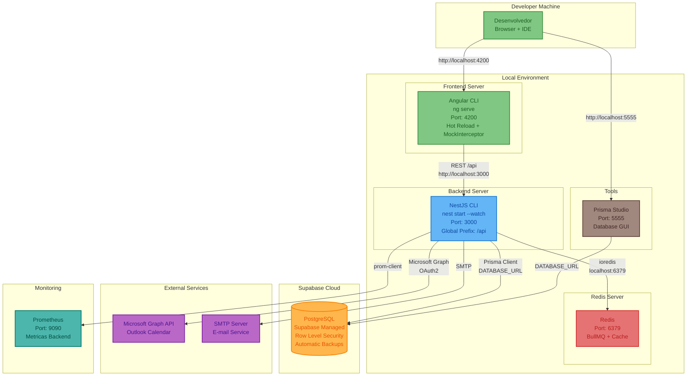
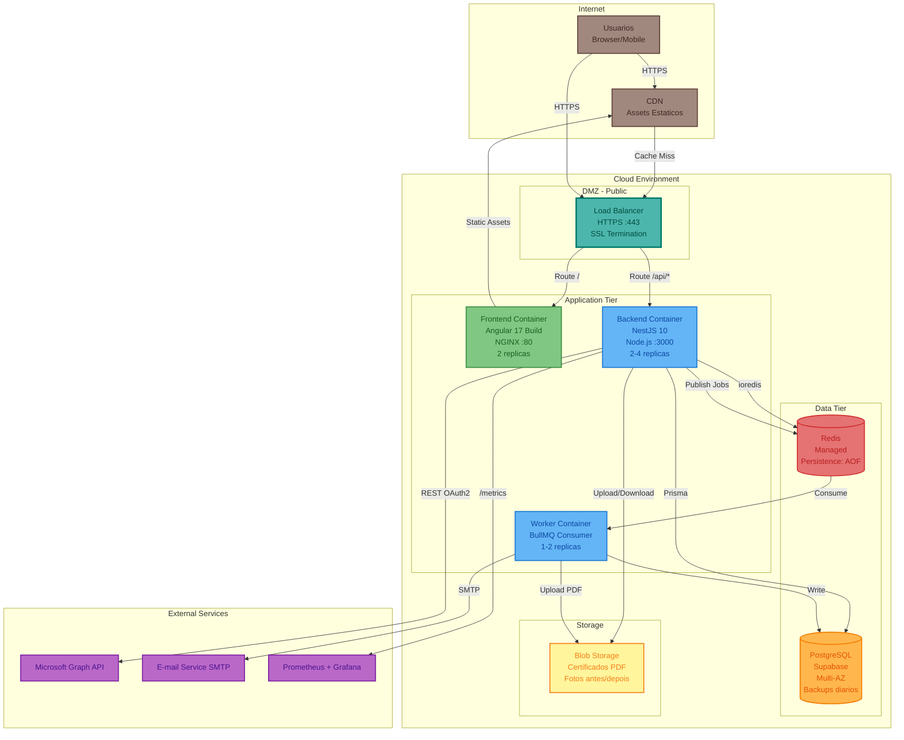

# Diagrama de Infraestrutura - Plataforma de Gestão de Eventos

**Versão**: 1.0 (Engenharia Reversa)
**Data**: 18/02/2026
**Tipo**: Deployment View
**Pergunta respondida**: "Como o sistema é implantado e onde cada componente roda?"

---

## Visão Geral

A infraestrutura atual utiliza Supabase como plataforma managed para PostgreSQL, com o backend NestJS e frontend Angular rodando em ambiente Node.js. O Redis é usado como broker para BullMQ (jobs assíncronos). O sistema expõe métricas via Prometheus.

---

## Diagrama de Infraestrutura - Ambiente de Desenvolvimento

---

## Diagrama de Infraestrutura - Producao (Recomendado)

---

## Especificacoes de Recursos (Producao Recomendada)

| Recurso | Tipo | Especificacao | Replicas | Custo Mensal Est. |
|---------|------|---------------|----------|-------------------|
| Load Balancer | HTTPS/SSL | 100 RPS, SSL termination | 1 | $25 |
| Frontend | Container NGINX | 1 vCPU, 1GB RAM | 2 | $30 |
| Backend API | Container Node.js | 2 vCPU, 4GB RAM | 2-4 | $120-240 |
| Worker | Container Node.js | 1 vCPU, 2GB RAM | 1-2 | $30-60 |
| PostgreSQL | Supabase Pro | 8GB RAM, 100GB SSD | 1 (Multi-AZ) | $25-75 |
| Redis | Managed | 2GB RAM, AOF persistence | 1 | $30 |
| Blob Storage | Object Storage | 50GB (certificados, fotos) | N/A | $5 |
| CDN | Global | Static assets cache | N/A | $10 |
| Prometheus + Grafana | Monitoring | Standard | 1 | $20 |
| **Total** | | | | **$295-495/mes** |

### Ambientes

| Ambiente | Proposito | Escala | Custo Est. |
|----------|-----------|--------|------------|
| Dev | Desenvolvimento local | Minimo (1 replica cada) | ~$80/mes |
| Staging | Testes/QA | Medio (1-2 replicas) | ~$200/mes |
| Producao | Usuarios finais | Completo (2-4 replicas) | ~$400/mes |
| **Total 3 ambientes** | | | **~$680/mes** |

---

## Variaveis de Ambiente Criticas

| Variavel | Container | Descricao |
|----------|-----------|-----------|
| DATABASE_URL | Backend, Worker | Connection string PostgreSQL (Supabase) |
| JWT_SECRET | Backend | Secret para assinar tokens JWT |
| JWT_EXPIRES_IN | Backend | Tempo de expiração do access token (default: 15m) |
| FRONTEND_URL | Backend | URL do frontend para CORS (default: http://localhost:4200) |
| REDIS_HOST | Backend, Worker | Host do Redis (default: localhost) |
| REDIS_PORT | Backend, Worker | Porta do Redis (default: 6379) |
| REDIS_PASSWORD | Backend, Worker | Senha do Redis (opcional) |
| RATE_LIMIT_TTL | Backend | TTL do rate limiting em segundos (default: 60) |
| RATE_LIMIT_MAX | Backend | Maximo de requests por TTL (default: 10) |
| PORT | Backend | Porta do servidor (default: 3000) |

---

*Documento gerado por engenharia reversa - Deployment View*
