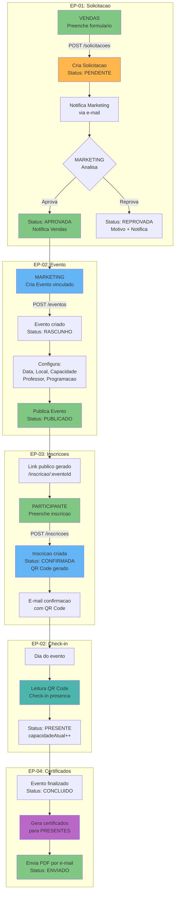
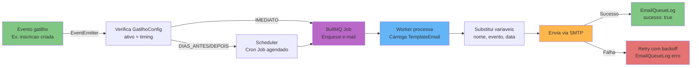

# Diagrama de Fluxo de Dados - Plataforma de Gestão de Eventos

**Versão**: 1.0 (Engenharia Reversa)
**Data**: 18/02/2026
**Tipo**: Data Flow Diagram
**Pergunta respondida**: "Como os dados fluem pelo sistema nos principais processos?"

---

## Fluxo 1: Login com 2FA (EP-08-F8.1)

```mermaid
graph LR
    A["Usuario preenche<br/>email + senha"] -->|"POST /auth/login"| B["AuthController<br/>@Public()"]
    B -->|"LoginDto"| C["AuthService<br/>login()"]
    C -->|"findUnique(email)"| D{"Usuario<br/>existe?"}
    D -->|"Nao"| E["Log: LOGIN_FALHA<br/>401 Unauthorized"]
    D -->|"Sim"| F{"Conta<br/>ativa?"}
    F -->|"Nao"| G["Log: ACESSO_NEGADO<br/>401 Unauthorized"]
    F -->|"Sim"| H{"Conta<br/>bloqueada?"}
    H -->|"Sim"| I["Log: ACESSO_NEGADO<br/>401 Blocked"]
    H -->|"Nao"| J{"Senha<br/>valida?<br/>bcrypt.compare"}
    J -->|"Nao"| K["Incrementa tentativas<br/>Bloqueia se >= 5<br/>Log: LOGIN_FALHA"]
    J -->|"Sim"| L{"2FA<br/>habilitado?"}
    L -->|"Sim, sem codigo"| M["Return:<br/>requiresTwoFactor: true"]
    L -->|"Sim, com codigo"| N{"Codigo TOTP<br/>valido?<br/>speakeasy.verify"}
    N -->|"Nao"| O{"Codigo<br/>recuperacao?"}
    O -->|"Nao"| P["Log: LOGIN_FALHA<br/>401 Invalid 2FA"]
    O -->|"Sim"| Q["Marca codigo usado"]
    N -->|"Sim"| Q
    L -->|"Nao"| Q
    Q --> R["Reset tentativas = 0<br/>bloqueadoAte = null"]
    R --> S["generateTokens()<br/>JWT access 15min<br/>Refresh UUID 7 dias"]
    S --> T["Salva RefreshToken<br/>no banco"]
    T --> U["Log: LOGIN_SUCESSO"]
    U --> V["Return:<br/>accessToken + refreshToken<br/>+ dados usuario"]

    style A fill:#81C784
    style B fill:#81C784,stroke:#388E3C,stroke-width:2px
    style C fill:#64B5F6,stroke:#1976D2,stroke-width:2px
    style D fill:#FFF59D,stroke:#F57F17,stroke-width:2px
    style E fill:#E57373,stroke:#D32F2F,stroke-width:2px
    style J fill:#FFF59D,stroke:#F57F17,stroke-width:2px
    style L fill:#FFF59D,stroke:#F57F17,stroke-width:2px
    style N fill:#FFF59D,stroke:#F57F17,stroke-width:2px
    style S fill:#64B5F6,stroke:#1976D2,stroke-width:2px
    style V fill:#81C784,stroke:#388E3C,stroke-width:2px
```

### Transformacoes de Dados - Login

| Etapa | Input | Transformacao | Output |
|-------|-------|---------------|--------|
| 1. Request | `{ email, senha, codigoTwoFactor? }` | Validacao DTO (class-validator) | LoginDto validado |
| 2. Busca | email lowercase | `findUnique({ email })` | Usuario entity ou null |
| 3. Senha | senha plaintext | `bcrypt.compare(senha, senhaHash)` | boolean |
| 4. 2FA | codigo TOTP | `speakeasy.totp.verify({ secret, token })` | boolean |
| 5. Tokens | { userId, email, perfil } | `jwtService.sign(payload)` + `uuidv4()` | { accessToken, refreshToken } |
| 6. Persist | refreshToken UUID | `refreshToken.create({ token, expiraEm: +7d })` | RefreshToken record |
| 7. Log | evento auth | `logAutenticacao.create({ ... })` | LogAutenticacao record |
| 8. Response | tokens + usuario | Map to DTO | `{ accessToken, refreshToken, usuario: { id, nome, email, perfil } }` |

---

## Fluxo 2: Ciclo de Vida do Evento (EP-01 + EP-02)

---

## Fluxo 3: Gestao de Pacientes Modelo (EP-05)

```mermaid
graph LR
    A["PROFESSOR/MARKETING<br/>Cadastra paciente"] -->|"POST /pacientes-modelo"| B["Valida dados<br/>CPF unico por evento"]
    B --> C["Criptografa dados sensiveis<br/>historicoSaude<br/>restricoesAlergias"]
    C --> D["Salva PacienteModelo<br/>AuditLog com hash chain"]
    D --> E["Registra Consentimento LGPD<br/>IP + UserAgent + Timestamp"]
    E --> F["PROFESSOR<br/>Preenche Anamnese"]
    F --> G["Upload fotos<br/>antes/depois"]
    G --> H["Workflow aprovacao<br/>documentos"]
    H --> I["MARKETING<br/>Revisa e aprova"]

    style A fill:#81C784
    style C fill:#E57373
    style D fill:#FFB74D
    style E fill:#4DB6AC
    style H fill:#BA68C8
```

### Dados Sensiveis (LGPD)

| Campo | Tipo | Tratamento |
|-------|------|------------|
| historicoSaude | Text | Criptografado no backend antes de salvar |
| restricoesAlergias | Text | Criptografado no backend antes de salvar |
| CPF | VarChar(11) | Unique constraint por evento |
| Consentimento | Record | IP, UserAgent, Timestamp registrados |
| Auditoria | Record | Hash chain (hash anterior + hash atual) para integridade |
| Exclusao | Soft-delete | deletedAt timestamp (nunca hard delete) |

---

## Fluxo 4: Comunicacao Automatizada (EP-06)

---

*Documento gerado por engenharia reversa - Data Flow Diagrams*
