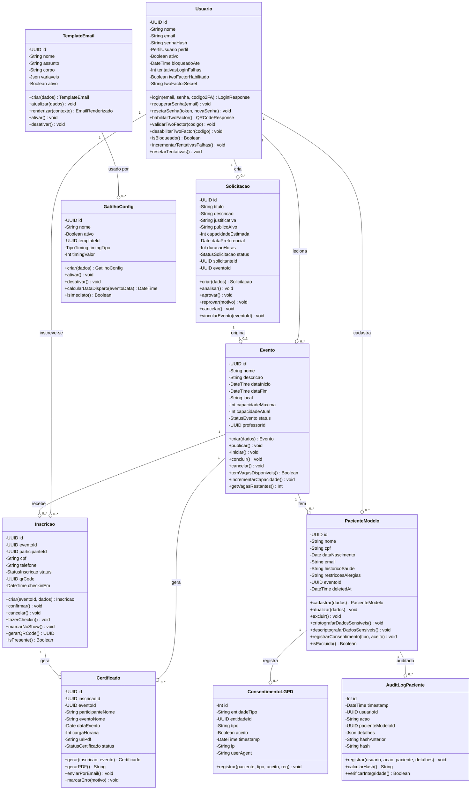
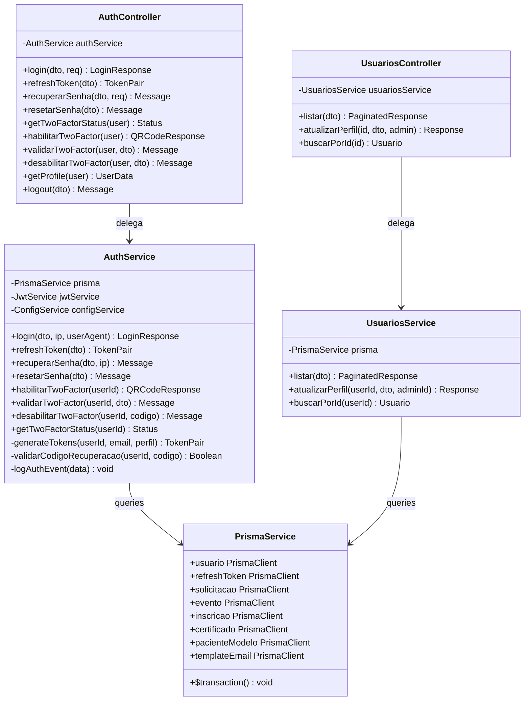
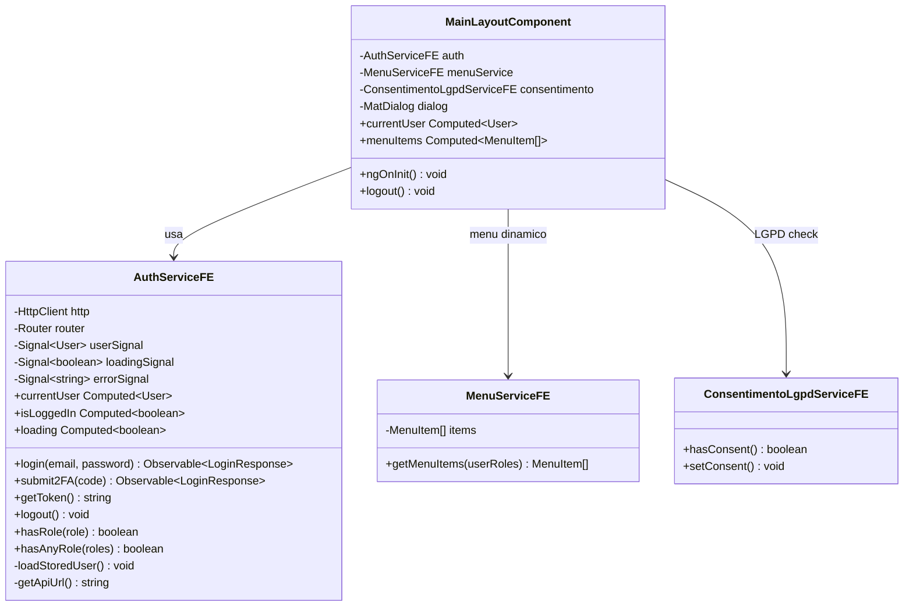
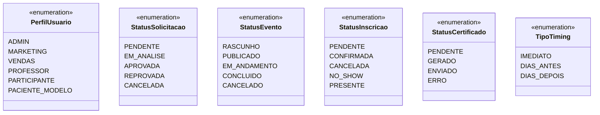

# Diagrama de Classes (Domain Model) - Plataforma de Gestão de Eventos

**Versão**: 1.0 (Engenharia Reversa)
**Data**: 18/02/2026
**Tipo**: Class Diagram (Domain Model)
**Fonte**: Prisma Schema + Backend Services + Frontend Services
**Pergunta respondida**: "Quais são os objetos de negócio e seus comportamentos?"

---

## Visão Geral

O modelo de domínio da Plataforma de Gestão de Eventos é organizado em 6 bounded contexts alinhados com os épicos: Autenticação, Solicitações, Eventos, Inscrições, Pacientes Modelo e Comunicação. Cada contexto possui entidades, value objects (enums) e serviços de domínio.

---

## Diagrama de Classes - Domínio Principal

---

## Diagrama de Classes - Servicos (Backend NestJS)

---

## Diagrama de Classes - Frontend Services

---

## Enumeracoes (Value Objects)

---

*Documento gerado por engenharia reversa - Class Diagram (Domain Model)*
