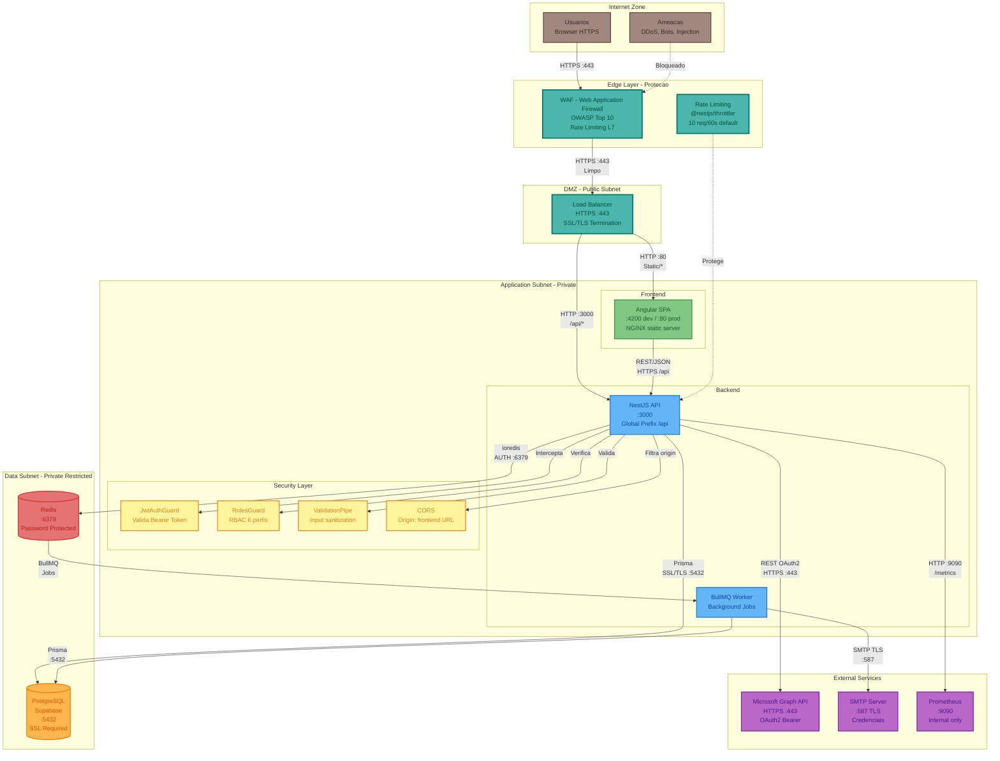

# Diagrama de Rede - Plataforma de Gestão de Eventos

**Versão**: 1.0 (Engenharia Reversa)
**Data**: 18/02/2026
**Tipo**: Network Topology
**Pergunta respondida**: "Como é a topologia de rede, conectividade e segurança?"

---

## Visão Geral

O diagrama de rede mapeia a topologia de conectividade, portas, protocolos e zonas de segurança do sistema. A arquitetura segue o princípio de defesa em profundidade com múltiplas camadas de proteção.

---

## Diagrama de Rede - Topologia Completa

---

## Regras de Firewall / Seguranca

| # | De | Para | Porta | Protocolo | Descricao | Status |
|---|----|----- |-------|-----------|-----------|--------|
| 1 | Internet | WAF | 443 | HTTPS | Trafego publico filtrado | Recomendado |
| 2 | WAF | Load Balancer | 443 | HTTPS | Trafego limpo | Recomendado |
| 3 | Load Balancer | Frontend | 80 | HTTP | Static assets (internal) | Recomendado |
| 4 | Load Balancer | Backend API | 3000 | HTTP | API requests (internal) | Implementado |
| 5 | Frontend SPA | Backend API | 3000 | REST/JSON | CORS: origin validado | Implementado |
| 6 | Backend API | PostgreSQL | 5432 | PostgreSQL/SSL | Prisma Client | Implementado |
| 7 | Backend API | Redis | 6379 | Redis AUTH | Cache + BullMQ publish | Implementado |
| 8 | BullMQ Worker | Redis | 6379 | Redis AUTH | Consume jobs | Implementado |
| 9 | BullMQ Worker | PostgreSQL | 5432 | PostgreSQL/SSL | Write results | Implementado |
| 10 | Backend API | Microsoft Graph | 443 | HTTPS OAuth2 | Outlook Calendar sync | Estruturado |
| 11 | Worker | SMTP Server | 587 | SMTP TLS | Envio de e-mails | Estruturado |
| 12 | Backend API | Prometheus | 9090 | HTTP | Expose /metrics | Implementado |

---

## Camadas de Seguranca (Defesa em Profundidade)

### Camada 1: Rede (Edge)

| Mecanismo | Implementacao | Descricao |
|-----------|--------------|-----------|
| WAF | Recomendado | OWASP Top 10, SQL Injection, XSS |
| CDN | Recomendado | Cache de assets, DDoS L3/L4 |
| SSL/TLS | Implementado (CORS) | Criptografia em transito |

### Camada 2: Aplicacao

| Mecanismo | Implementacao | Descricao |
|-----------|--------------|-----------|
| Rate Limiting | `@nestjs/throttler` (global) | 10 req/60s (configuravel) |
| CORS | `app.enableCors({ origin, credentials })` | Restringe origens |
| Input Validation | `ValidationPipe({ whitelist, forbidNonWhitelisted })` | Rejeita campos desconhecidos |
| Helmet | Recomendado | Headers de seguranca HTTP |

### Camada 3: Autenticacao/Autorizacao

| Mecanismo | Implementacao | Descricao |
|-----------|--------------|-----------|
| JWT Auth | `JwtAuthGuard` (global) | Valida token em todas as rotas |
| RBAC | `RolesGuard` + `@RequireRoles()` | 6 perfis com permissoes granulares |
| 2FA TOTP | speakeasy + QR Code | Segundo fator opcional |
| Account Lockout | 5 tentativas = bloqueio 1h | Previne brute force |
| Refresh Token Rotation | UUID + revogacao no banco | Previne token reuse |
| Password Hashing | bcrypt (rounds: 12) | Armazenamento seguro |
| @Public() decorator | Marca rotas sem auth | Whitelist explicita |

### Camada 4: Dados

| Mecanismo | Implementacao | Descricao |
|-----------|--------------|-----------|
| Encryption at Rest | Criptografia de dados sensiveis (backend) | historicoSaude, restricoesAlergias |
| RLS (Row Level Security) | Supabase | Isolamento de dados por contexto |
| Soft Delete | `deletedAt` em PacienteModelo | LGPD compliance |
| Audit Chain | Hash SHA-256 encadeado | Integridade de logs de auditoria |
| Consentimento LGPD | Registro com IP/UserAgent/Timestamp | Rastreabilidade legal |

### Camada 5: Observabilidade

| Mecanismo | Implementacao | Descricao |
|-----------|--------------|-----------|
| Auth Logging | `LogAutenticacao` (15 campos) | Toda tentativa de auth e logada |
| Audit Trail | `AuditLogPacienteModelo` com hash chain | Rastreabilidade LGPD |
| Metrics | Prometheus (prom-client) | Performance e disponibilidade |
| Winston Logs | Estruturados (JSON) | Logs de aplicacao |
| Geolocation | geoip-lite | IP para pais/cidade em auth logs |

---

## Portas e Protocolos (Resumo)

| Servico | Porta | Protocolo | Interno/Externo |
|---------|-------|-----------|-----------------|
| Angular CLI (dev) | 4200 | HTTP | Interno |
| NGINX (prod) | 80/443 | HTTP/HTTPS | Publico via LB |
| NestJS API | 3000 | HTTP | Interno |
| PostgreSQL | 5432 | PostgreSQL/SSL | Interno |
| Redis | 6379 | Redis Protocol | Interno |
| Prisma Studio | 5555 | HTTP | Dev only |
| Prometheus | 9090 | HTTP | Interno |
| Microsoft Graph | 443 | HTTPS OAuth2 | Externo |
| SMTP | 587 | SMTP TLS | Externo |

---

*Documento gerado por engenharia reversa - Network Topology*
