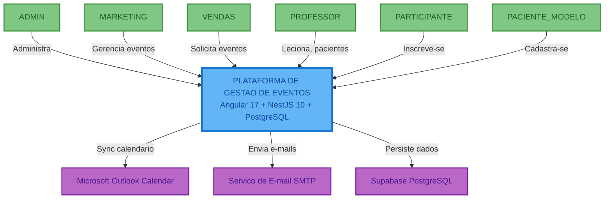
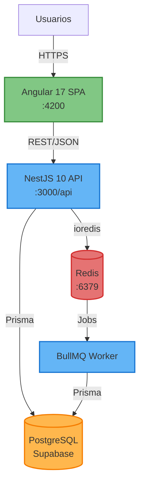
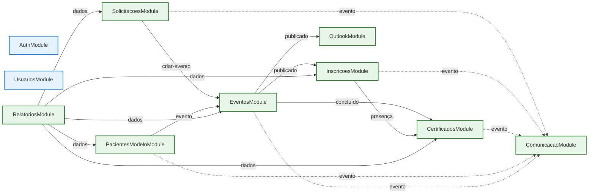

# Documento de Arquitetura Completo - Plataforma de Gestão de Eventos

**Versão**: 1.0 (Engenharia Reversa)
**Data**: 18/02/2026
**Método**: Engenharia reversa do código-fonte, épicos, features e user stories
**Status**: MVP Implementado (Frontend 100%, Backend parcial)

---

## Sumário Executivo

A **Plataforma de Gestão de Eventos** é um sistema web corporativo que gerencia o ciclo completo de eventos educacionais/clínicos. O sistema permite que equipes de Vendas solicitem eventos, Marketing aprove e publique, participantes se inscrevam via formulário público, professores gerenciem pacientes modelo, e administradores controlem certificados, comunicação e conformidade LGPD.

A arquitetura é baseada em uma **SPA Angular 17** comunicando-se com uma **API REST NestJS 10** que persiste dados em **PostgreSQL (Supabase)** e usa **Redis/BullMQ** para processamento assíncrono. A segurança implementa **JWT com 2FA TOTP**, **RBAC com 6 perfis** e **compliance LGPD** com auditoria por hash chain.

O projeto contém **9 épicos**, **48 features**, **185 user stories** (76 frontend + 109 backend), **43 componentes de página**, **45+ rotas** e **15 tabelas** no banco de dados.

---

## Tecnologias Principais

| Camada | Tecnologia | Versão |
|--------|-----------|--------|
| Frontend | Angular + TypeScript + Material | 17.3 / 5.4 / 17 |
| Backend | NestJS + TypeScript | 10.3 / 5.3 |
| ORM | Prisma | 4.16 |
| Database | PostgreSQL (Supabase) | Managed |
| Cache/Queue | Redis + BullMQ | 5.3 / 5.1 |
| Auth | JWT + Passport + 2FA (speakeasy) | 10.2 |
| Monitoring | Prometheus + Winston | 15.1 / 3.11 |

### Características Principais

- Escalável: Standalone Components com lazy loading, NestJS modular
- Seguro: JWT + 2FA + RBAC + Rate Limiting + LGPD compliance
- Observável: Prometheus metrics + Winston logs + Auth audit trail
- Resiliente: BullMQ retry, refresh token rotation, account lockout

---

## Índice de Diagramas

| # | Diagrama | Arquivo | Tipo |
|---|----------|---------|------|
| 0 | Decisões Tecnológicas + ADRs | `00_DECISOES_TECNOLOGICAS.md` | ADR |
| 1 | Diagrama de Contexto | `01_C4_CONTEXTO_Level1.md` | C4 Level 1 |
| 2 | Diagrama de Containers | `02_C4_CONTAINERS_Level2.md` | C4 Level 2 |
| 3 | Diagrama de Componentes | `03_C4_COMPONENTES_Level3.md` | C4 Level 3 |
| | | | |
| | **C4 Level 4 - Código (10 Módulos)** | | **C4 Level 4** |
| 3B | Auth Module (EP-08) | `03B_C4_CODIGO_Level4.md` | Implementado |
| 3C | Usuarios Module (EP-08) | `03C_C4_CODIGO_Level4_Usuarios.md` | Implementado |
| 3D | Solicitações Module (EP-01) | `03D_C4_CODIGO_Level4_Solicitacoes.md` | Projetado |
| 3E | Eventos Module (EP-02) | `03E_C4_CODIGO_Level4_Eventos.md` | Projetado |
| 3F | Inscrições Module (EP-03) | `03F_C4_CODIGO_Level4_Inscricoes.md` | Projetado |
| 3G | Certificados Module (EP-04) | `03G_C4_CODIGO_Level4_Certificados.md` | Projetado |
| 3H | Pacientes Modelo Module (EP-05) | `03H_C4_CODIGO_Level4_PacientesModelo.md` | Projetado |
| 3I | Comunicação Module (EP-06) | `03I_C4_CODIGO_Level4_Comunicacao.md` | Projetado |
| 3J | Outlook Module (EP-07) | `03J_C4_CODIGO_Level4_Outlook.md` | Projetado |
| 3K | Relatórios Module (EP-09) | `03K_C4_CODIGO_Level4_Relatorios.md` | Projetado |
| | | | |
| 4 | Diagrama de Infraestrutura | `04_DIAGRAMA_INFRAESTRUTURA.md` | Deployment |
| 5 | Diagrama de Fluxo de Dados | `05_DIAGRAMA_FLUXO_DADOS.md` | Data Flow |
| 6 | Diagrama ER | `06_DIAGRAMA_ER.md` | Entity-Relationship |
| 7 | Diagrama de Classes | `07_DIAGRAMA_CLASSES.md` | Domain Model |
| 8 | Diagrama de Rede | `08_DIAGRAMA_REDE.md` | Network Topology |
| 9 | Documento Consolidado | `09_DOCUMENTO_ARQUITETURA_COMPLETO.md` | Este documento |

---

## 1. Diagrama de Contexto (C4-L1)

> Detalhes completos em `01_C4_CONTEXTO_Level1.md`



**6 personas** | **3 sistemas externos** | **6 perfis RBAC**

---

## 2. Diagrama de Containers (C4-L2)

> Detalhes completos em `02_C4_CONTAINERS_Level2.md`



**5 containers** | Angular SPA + NestJS API + PostgreSQL + Redis + BullMQ Worker

---

## 3. Diagrama de Componentes (C4-L3)

> Detalhes completos em `03_C4_COMPONENTES_Level3.md`

### Backend: 14 componentes implementados

| Tipo | Componentes |
|------|------------|
| Controllers | AuthController (10 endpoints), UsuariosController (3 endpoints) |
| Services | AuthService, UsuariosService, PrismaService |
| Guards | JwtAuthGuard, RolesGuard, ThrottlerGuard (todos globais) |
| Decorators | @Public(), @CurrentUser(), @RequireRoles() |
| Pipes/Filters | ValidationPipe (global), HttpExceptionFilter (global) |

### Frontend: 43 componentes de página + core

| Épico | Componentes | Descrição |
|-------|------------|-----------|
| EP-01 | 3 | Solicitações |
| EP-02 | 6 | Eventos, Participantes, Check-in |
| EP-03 | 3 | Inscrição, Área Participante |
| EP-04 | 3 | Certificados |
| EP-05 | 8 | Pacientes Modelo, Documentos |
| EP-06 | 3 | Templates, Gatilhos |
| EP-07 | 3 | Outlook Integration |
| EP-08 | 8 | Auth, RBAC, LGPD |
| EP-09 | 2 | Relatórios, Dashboard |
| Nav | 2 | Dashboard, Documentos Hub |

---

## 3B. Diagrama de Código (C4-L4) - Auth Module

> Detalhes completos em `03B_C4_CODIGO_Level4.md`

O C4 Level 4 detalha o componente mais crítico do sistema: o **Auth Module** (EP-08). Este módulo contém 14 arquivos / ~962 linhas TypeScript e implementa o fluxo completo de autenticação.

### Estrutura do Auth Module

```
src/auth/
├── auth.module.ts              # Module (imports Passport, JWT)
├── auth.controller.ts          # 10 endpoints REST
├── auth.service.ts             # 580 linhas de lógica
├── strategies/jwt.strategy.ts  # Passport JWT extraction + user validation
├── guards/
│   ├── jwt-auth.guard.ts       # Global guard (respeita @Public)
│   └── roles.guard.ts          # RBAC guard (verifica @RequireRoles)
├── decorators/
│   ├── public.decorator.ts     # @Public() - rota sem auth
│   ├── current-user.decorator.ts   # @CurrentUser() - extrai user
│   └── require-roles.decorator.ts  # @RequireRoles(ADMIN)
└── dto/                        # 5 arquivos, 11 DTOs com class-validator
```

### Diagramas incluídos no Level 4

| Diagrama | Conteúdo |
|----------|----------|
| Visão Geral do Module | AuthModule imports, providers, exports |
| Diagrama de Classes completo | 14 classes/interfaces + todos os DTOs + decorators |
| Sequência: Login com 2FA | Fluxo detalhado passo a passo com todos os cenários |
| Sequência: Habilitar 2FA | QR Code generation + códigos recuperação |
| Sequência: Refresh Token | Token rotation com revogação |

### 12 Regras de Negócio de Autenticação

| Regra | Implementação |
|-------|--------------|
| Senha mín. 8 chars | `@MinLength(8)` |
| Senha forte no reset | Regex: maiúscula + minúscula + número + especial |
| Bloqueio 5 tentativas | `bloqueadoAte = addHours(1)` |
| Recuperação não revela email | Sempre retorna sucesso |
| Refresh token rotation | Antigo revogado, novo criado |
| Reset revoga todos os tokens | `refreshToken.updateMany({revogado: true})` |
| 2FA tolerância 2 janelas | `speakeasy.totp.verify({window: 2})` |
| 10 códigos recuperação 2FA | Hashados com bcrypt(10) |

---

## 3B-3K. C4 Level 4 - Código (Todos os 10 Módulos)

> Cada módulo possui seu documento dedicado com diagramas de classes, sequência, máquina de estados, endpoints REST e estrutura de arquivos.

### Visão Geral dos Módulos

| # | Módulo | Épico | Status | Arquivo | Classes | Endpoints | Linhas Est. |
|---|--------|-------|--------|---------|---------|-----------|-------------|
| 3B | **AuthModule** | EP-08 | Implementado | `03B_C4_CODIGO_Level4.md` | 17 | 10 | ~962 |
| 3C | **UsuariosModule** | EP-08 | Implementado | `03C_C4_CODIGO_Level4_Usuarios.md` | 7 | 3 | ~190 |
| 3D | **SolicitacoesModule** | EP-01 | Projetado | `03D_C4_CODIGO_Level4_Solicitacoes.md` | 11 | 10 | ~600 |
| 3E | **EventosModule** | EP-02 | Projetado | `03E_C4_CODIGO_Level4_Eventos.md` | 10 | 9 | ~500 |
| 3F | **InscricoesModule** | EP-03 | Projetado | `03F_C4_CODIGO_Level4_Inscricoes.md` | 12 | 8 | ~700 |
| 3G | **CertificadosModule** | EP-04 | Projetado | `03G_C4_CODIGO_Level4_Certificados.md` | 9 | 8 | ~550 |
| 3H | **PacientesModeloModule** | EP-05 | Projetado | `03H_C4_CODIGO_Level4_PacientesModelo.md` | 12 | 12 | ~1200 |
| 3I | **ComunicacaoModule** | EP-06 | Projetado | `03I_C4_CODIGO_Level4_Comunicacao.md` | 12 | 14 | ~900 |
| 3J | **OutlookModule** | EP-07 | Projetado | `03J_C4_CODIGO_Level4_Outlook.md` | 10 | 11 | ~800 |
| 3K | **RelatoriosModule** | EP-09 | Projetado | `03K_C4_CODIGO_Level4_Relatorios.md` | 14 | 12 | ~900 |
| | **TOTAL** | | | **10 documentos** | **~114** | **~97** | **~7.302** |

### Mapa de Dependências Inter-Módulos



### Padrões Arquiteturais Consistentes

Todos os módulos seguem o mesmo padrão NestJS:

1. **Module** → registra controllers, providers, imports
2. **Controller** → endpoints REST, validação com DTOs, decorators de auth
3. **Service** → lógica de negócio, acesso ao Prisma, emissão de eventos
4. **Processor** (quando aplicável) → BullMQ jobs assíncronos
5. **DTOs** → validação com class-validator, transformação com class-transformer

| Padrão | Módulos que usam |
|--------|-----------------|
| EventEmitter (event-driven) | Solicitações, Eventos, Inscrições, Certificados, Pacientes, Comunicação |
| BullMQ (jobs assíncronos) | Certificados, Comunicação, Outlook, Relatórios |
| Criptografia AES-256 | Pacientes Modelo |
| Audit Log (hash chain) | Pacientes Modelo |
| Máquina de Estados | Solicitações (5 estados), Eventos (5 estados), Inscrições (5 estados), Certificados (4 estados) |
| RBAC granular | Todos os módulos |

---

## 4. Diagrama de Infraestrutura

> Detalhes completos em `04_DIAGRAMA_INFRAESTRUTURA.md`

| Ambiente | Frontend | Backend | Database | Redis | Custo Est. |
|----------|----------|---------|----------|-------|------------|
| Dev | Angular CLI :4200 | NestJS CLI :3000 | Supabase Free | Local :6379 | ~$80/mês |
| Staging | NGINX Container | Node.js Container | Supabase Pro | Managed | ~$200/mês |
| Produção | NGINX x2 | Node.js x2-4 | Supabase Pro Multi-AZ | Managed AOF | ~$400/mês |

---

## 5. Diagrama de Fluxo de Dados

> Detalhes completos em `05_DIAGRAMA_FLUXO_DADOS.md`

### 4 fluxos principais documentados:

1. **Login com 2FA** (EP-08): Email/Senha -> Validação -> 2FA TOTP -> JWT Generation -> Refresh Token
2. **Ciclo de Vida do Evento** (EP-01 + EP-02 + EP-03 + EP-04): Solicitação -> Aprovação -> Publicação -> Inscrição -> Check-in -> Certificado
3. **Gestão Pacientes Modelo** (EP-05): Cadastro -> Criptografia -> Auditoria -> Consentimento LGPD -> Documentos -> Aprovação
4. **Comunicação Automatizada** (EP-06): Evento gatilho -> GatilhoConfig -> BullMQ -> Template render -> SMTP -> Log

---

## 6. Diagrama ER (Entidade-Relacionamento)

> Detalhes completos em `06_DIAGRAMA_ER.md`

### 15 tabelas, 8 enums, 30+ índices

| Domínio | Tabelas | Descrição |
|---------|---------|-----------|
| Auth (EP-08) | 4 | usuarios, refresh_tokens, tokens_recuperacao_senha, codigos_recuperacao_2fa |
| Audit (EP-08) | 2 | logs_autenticacao, audit_log_pacientes_modelo |
| Solicitações (EP-01) | 1 | solicitacoes |
| Eventos (EP-02) | 1 | eventos |
| Inscrições (EP-03) | 1 | inscricoes |
| Certificados (EP-04) | 1 | certificados |
| Pacientes (EP-05) | 2 | pacientes_modelo, consentimentos_lgpd |
| Comunicação (EP-06) | 3 | templates_email, gatilhos_config, email_queue_log, lembretes_enviados |

---

## 7. Diagrama de Classes (Domain Model)

> Detalhes completos em `07_DIAGRAMA_CLASSES.md`

### 6 bounded contexts:

1. **Autenticação**: Usuario, RefreshToken, LogAutenticacao
2. **Solicitações**: Solicitacao (PENDENTE -> EM_ANALISE -> APROVADA/REPROVADA)
3. **Eventos**: Evento (RASCUNHO -> PUBLICADO -> EM_ANDAMENTO -> CONCLUIDO)
4. **Inscrições**: Inscricao (PENDENTE -> CONFIRMADA -> PRESENTE), QR Code
5. **Pacientes Modelo**: PacienteModelo, ConsentimentoLGPD, AuditLog (hash chain)
6. **Comunicação**: TemplateEmail, GatilhoConfig, EmailQueueLog

---

## 8. Diagrama de Rede

> Detalhes completos em `08_DIAGRAMA_REDE.md`

### 5 camadas de segurança:

| Camada | Mecanismos |
|--------|-----------|
| 1. Rede | WAF, CDN, SSL/TLS |
| 2. Aplicação | Rate Limiting, CORS, Input Validation |
| 3. Auth/AuthZ | JWT, RBAC (6 perfis), 2FA TOTP, Account Lockout |
| 4. Dados | Encryption at rest, RLS, Soft Delete, Hash Chain Audit |
| 5. Observabilidade | Auth Logs, Audit Trail, Prometheus, Winston, GeoIP |

---

## Decisões Arquiteturais (ADRs)

> Detalhes completos em `00_DECISOES_TECNOLOGICAS.md`

| ADR | Decisão | Justificativa Principal |
|-----|---------|------------------------|
| ADR-001 | Angular 17 | Standalone Components, Material UI, TypeScript strict |
| ADR-002 | NestJS 10 | Arquitetura modular, DI, ecossistema rich (JWT, Passport, BullMQ) |
| ADR-003 | PostgreSQL + Prisma | ACID, type-safe queries, Supabase managed |
| ADR-004 | JWT + 2FA | Stateless, escalável, segurança forte com TOTP |
| ADR-005 | BullMQ + Redis | Jobs assíncronos resilientes, retry automático |
| ADR-006 | LGPD Compliance | Consentimento, criptografia, soft-delete, audit chain |

---

## Requisitos Não-Funcionais

### Performance

| Métrica | Alvo | Mecanismo |
|---------|------|-----------|
| Response time API | < 200ms (p95) | Prisma queries otimizadas, índices |
| Frontend load | < 3s (first paint) | Lazy loading, Angular Signals |
| Database queries | < 50ms | 30+ índices, connection pooling |

### Escalabilidade

| Aspecto | Estratégia |
|---------|-----------|
| Frontend | Lazy loading por rota (45+ componentes) |
| Backend | NestJS modular, horizontal scaling |
| Database | Supabase managed, read replicas possíveis |
| Cache | Redis para sessions e BullMQ |
| Queue | BullMQ com retry automático |

### Disponibilidade

| Aspecto | Alvo |
|---------|------|
| Uptime | 99.5% (43.8h downtime/ano) |
| Recovery | Supabase backups diários |
| Failover | Multi-AZ em produção |

### Segurança

| Aspecto | Implementação |
|---------|--------------|
| Encryption in transit | HTTPS/TLS, PostgreSQL SSL |
| Encryption at rest | Dados sensíveis criptografados (backend) |
| Authentication | JWT (15min) + Refresh Token (7d) + 2FA TOTP |
| Authorization | RBAC com 6 perfis, Guards globais |
| Compliance | LGPD: consentimento, auditoria, soft-delete |
| Anti-brute force | Rate limiting + account lockout (5 tentativas) |

---

## Observabilidade

| Pilar | Ferramenta | Detalhes |
|-------|-----------|----------|
| Logs | Winston 3.11 | Estruturados (JSON), console |
| Métricas | Prometheus (prom-client 15.1) | Endpoint /metrics, custom metrics |
| Audit | LogAutenticacao + AuditLogPaciente | 15 campos, hash chain, geolocalização |
| Geo | geoip-lite 1.4 | IP -> País/Cidade em logs de auth |

---

## Roadmap Técnico

### Fase 1: MVP - Concluída

- Frontend: 43 componentes implementados com Mock API
- Backend: Auth completo (login, 2FA, recuperação, RBAC)
- Database: Schema completo (15 tabelas, migrations)
- Segurança: JWT + 2FA + Guards + Rate Limiting

### Fase 2: Backend Completo (Próximo)

- Implementar módulos: Eventos, Inscrições, Certificados, Pacientes, Comunicação
- Conectar frontend ao backend real (remover MockInterceptor)
- Integração Microsoft Graph (Outlook Calendar)
- Integração SMTP (envio real de e-mails)

### Fase 3: Produção

- Setup de ambientes (Dev, Staging, Prod)
- CI/CD pipeline
- Monitoramento e alertas (Prometheus + Grafana)
- Testes automatizados (Jest, Jasmine)
- WAF e CDN

### Fase 4: Evolução

- Relatórios avançados e exportações
- Dashboard gerencial com dados reais
- Otimizações de performance (caching, read replicas)
- Mobile responsive refinements

---

## Riscos Técnicos

| Risco | Probabilidade | Impacto | Mitigação |
|-------|---------------|---------|-----------|
| Backend incompleto | Alta | Alto | Priorizar módulos por épico crítico (EP-02, EP-03) |
| Dependência Supabase | Baixa | Médio | Prisma é DB-agnostic, migração possível |
| MockInterceptor em prod | Média | Crítico | Remover antes de deploy, feature flag |
| Escalabilidade Redis | Baixa | Médio | Redis AOF persistence, managed instance |
| Compliance LGPD | Média | Alto | Audit trail implementado, revisão jurídica pendente |
| Secret management | Média | Alto | Migrar de .env para vault/secrets manager |

---

## Métricas do Projeto

| Categoria | Valor |
|-----------|-------|
| Épicos | 9 |
| Features | 48 |
| User Stories | 185 (76 FE + 109 BE) |
| Componentes Frontend | 43 páginas + core |
| Rotas | 45+ |
| Endpoints Backend | 13 implementados |
| Tabelas | 15 |
| Enums | 8 |
| Índices DB | 30+ |
| Linhas de código | ~53.000 |

---

*Documento de Arquitetura gerado por engenharia reversa completa do projeto Plataforma de Gestão de Eventos.*
*Método: Análise de código-fonte (Angular 17 + NestJS 10 + Prisma Schema), épicos, features e user stories.*
*Padrão: C4 Model (3 níveis) + 9 diagramas Mermaid + ADRs*
